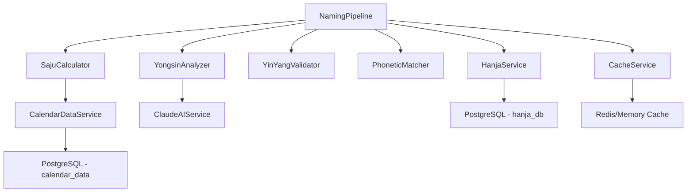

# NamingPipeline Architecture

## Overview

8단계 파이프라인을 통해 한국 전통 작명 서비스를 제공하는 시스템 아키텍처입니다.

**성능 목표**: 전체 파이프라인 실행 <10초

## Architecture Diagram

```
┌─────────────────────────────────────────────────────────────┐
│                     NamingPipeline                           │
│                                                               │
│  Input: BirthInfo + LastName                                │
│                                                               │
│  ┌─────────────────────────────────────────────────────┐   │
│  │ Step 1: Saju Calculation (~50-100ms)                │   │
│  │ - 생년월일시 → 사주팔자                              │   │
│  │ - Component: SajuCalculator                          │   │
│  │ - Dependency: CalendarDataService (DB)              │   │
│  └────────────────┬────────────────────────────────────┘   │
│                   │ SajuResult                              │
│  ┌────────────────▼────────────────────────────────────┐   │
│  │ Step 2: Yongsin Analysis (~500-2000ms)             │   │
│  │ - 5가지 전통 방법 + AI 분석                         │   │
│  │ - Component: YongsinAnalyzer                        │   │
│  │ - Dependency: ClaudeAIService (optional)           │   │
│  │ - Fallback: Traditional methods only                │   │
│  └────────────────┬────────────────────────────────────┘   │
│                   │ YongsinResult (primary, secondary)      │
│  ┌────────────────▼────────────────────────────────────┐   │
│  │ Step 3: Hanja Recommendation (~100-200ms)          │   │
│  │ - 용신 오행 기반 한자 필터링                        │   │
│  │ - Component: HanjaService                           │   │
│  │ - Fallback: Expand to secondary element            │   │
│  └────────────────┬────────────────────────────────────┘   │
│                   │ HanjaPool (filtered characters)         │
│  ┌────────────────▼────────────────────────────────────┐   │
│  │ Step 4: Combination Generation (~200-500ms)        │   │
│  │ - 2자 이름 조합 생성 (최대 10,000개)                │   │
│  │ - Strategy: Early limiting to control complexity   │   │
│  └────────────────┬────────────────────────────────────┘   │
│                   │ Combinations (name pairs)               │
│  ┌────────────────▼────────────────────────────────────┐   │
│  │ Step 5: Validation (~1-3s, batched)                │   │
│  │ - 81수리 (Numerology)                               │   │
│  │ - 음양 균형 (YinYang Balance)                       │   │
│  │ - 음운 조화 (Phonetic Harmony)                      │   │
│  │ - Components: Numerology81, YinYangValidator,      │   │
│  │               PhoneticMatcher                        │   │
│  │ - Strategy: Batch processing (100개 단위)           │   │
│  └────────────────┬────────────────────────────────────┘   │
│                   │ ValidatedCandidates                      │
│  ┌────────────────▼────────────────────────────────────┐   │
│  │ Step 6: Scoring (integrated with Step 5)           │   │
│  │ - 종합 점수 계산 (가중치 적용)                      │   │
│  │   • 용신: 35%                                        │   │
│  │   • 음양: 25%                                        │   │
│  │   • 발음: 20%                                        │   │
│  │   • 의미: 10%                                        │   │
│  │   • 81수리: 5%                                       │   │
│  │   • 금기: 5%                                         │   │
│  └────────────────┬────────────────────────────────────┘   │
│                   │ ScoredCandidates                         │
│  ┌────────────────▼────────────────────────────────────┐   │
│  │ Step 7: Filtering (~10-50ms)                       │   │
│  │ - 최소 점수 필터링 (default: 60점)                  │   │
│  │ - 용신 매치 필수 (optional)                         │   │
│  │ - 흉수 제거 (optional)                               │   │
│  └────────────────┬────────────────────────────────────┘   │
│                   │ FilteredCandidates                       │
│  ┌────────────────▼────────────────────────────────────┐   │
│  │ Step 8: Ranking & Return (~10ms)                   │   │
│  │ - 점수순 정렬                                        │   │
│  │ - Top N 선택 (default: 20개)                        │   │
│  │ - 순위 할당                                          │   │
│  └────────────────┬────────────────────────────────────┘   │
│                   │                                          │
│  Output: NamingResponse (top candidates + metadata)        │
└─────────────────────────────────────────────────────────────┘
```

## Component Dependencies



## Dependency Injection Pattern

모든 서비스는 생성자를 통해 주입되어 테스트 용이성과 유연성을 보장합니다:

```typescript
// Production
const pipeline = new NamingPipeline(
  new SajuCalculator(),
  new YongsinAnalyzer(),
  new YinYangValidator(),
  new PhoneticMatcher(),
  new DatabaseHanjaService(prisma),
  new RedisCacheService(redis)
);

// Testing
const pipeline = new NamingPipeline(
  new MockSajuCalculator(),
  new MockYongsinAnalyzer(),
  new YinYangValidator(),
  new PhoneticMatcher(),
  new InMemoryHanjaService(),
  new InMemoryCacheService()
);
```

## Performance Optimization Strategies

### 1. **Batch Processing** (Step 5)
- 조합을 100개씩 배치로 처리
- 메모리 사용량 제어
- 타임아웃 방지

### 2. **Early Filtering** (Step 4)
- 최대 조합 수 제한 (default: 10,000)
- 불필요한 조합 조기 제거

### 3. **Parallel Validation** (Step 5)
- 81수리, 음양, 음운 동시 검증
- 독립적인 검증 로직으로 병렬화 가능

### 4. **Result Caching** (전체)
- 동일 사주 재사용 (TTL: 1시간)
- Cache key: `naming:{birth_info}:{lastName}:{strokes}`

### 5. **Progressive Filtering** (Steps 5-7)
- 각 단계에서 후보 수 감소
- 최종 단계에서만 상세 분석

## Error Handling Strategy

### Graceful Degradation

각 단계는 독립적으로 실패 처리가 가능하며, 부분 결과를 반환합니다:

```typescript
try {
  await step1_calculateSaju(context);
  await step2_analyzeYongsin(context);
  await step3_recommendHanja(context);
  // ... more steps
} catch (error) {
  // Return partial results if available
  return handlePipelineError(context, error);
}
```

### Fallback Mechanisms

1. **Step 2 (Yongsin)**: AI 실패 시 전통 방법만 사용
2. **Step 3 (Hanja)**: Primary 풀 부족 시 Secondary 추가
3. **Step 5 (Validation)**: 개별 후보 검증 실패 시 건너뛰기
4. **전체 파이프라인**: 에러 시 부분 결과 반환

### Error Types

```typescript
class PipelineError extends Error {
  constructor(
    public step: string,
    message: string,
    public originalError?: Error
  ) {
    super(`[${step}] ${message}`);
  }
}
```

## Configuration

### Default Configuration

```typescript
const DEFAULT_PIPELINE_CONFIG: PipelineConfig = {
  maxCombinations: 10000,
  maxCandidates: 20,
  batchSize: 100,
  timeout: 10000,
  weights: {
    yongsin: 0.35,
    yinyang: 0.25,
    pronunciation: 0.20,
    meaning: 0.10,
    numerology: 0.05,
    taboo: 0.05,
  },
  minScore: 60,
  requireYongsinMatch: true,
  avoidInauspicious: true,
  cacheEnabled: true,
  cacheTTL: 3600,
};
```

### Custom Configuration

```typescript
const result = await pipeline.execute(
  birthInfo,
  lastName,
  lastNameStrokes,
  {
    maxCandidates: 50,
    weights: {
      yongsin: 0.40,
      yinyang: 0.30,
      pronunciation: 0.15,
      meaning: 0.10,
      numerology: 0.03,
      taboo: 0.02,
    },
    minScore: 70,
  }
);
```

## Usage Examples

### Basic Usage

```typescript
import { createNamingPipeline } from '~/lib/naming/pipeline/naming-pipeline';

// Create pipeline with dependencies
const pipeline = createNamingPipeline(hanjaService, cacheService);

// Execute
const birthInfo: BirthInfo = {
  year: 1990,
  month: 5,
  day: 15,
  hour: 14,
  minute: 30,
  isLunar: false,
  gender: 'M',
};

const result = await pipeline.execute(
  birthInfo,
  '김', // lastName
  8     // lastNameStrokes
);

console.log(`Found ${result.candidates.length} candidates`);
console.log(`Top candidate: ${result.candidates[0].firstName}`);
console.log(`Score: ${result.candidates[0].score}`);
```

### Advanced Usage with Custom Config

```typescript
const result = await pipeline.execute(
  birthInfo,
  '이',
  7,
  {
    maxCandidates: 50,
    requireYongsinMatch: false,
    avoidInauspicious: false,
    weights: {
      yongsin: 0.30,
      yinyang: 0.30,
      pronunciation: 0.20,
      meaning: 0.15,
      numerology: 0.03,
      taboo: 0.02,
    },
  }
);
```

## Testing Strategy

### Unit Tests

각 단계별 독립 테스트:

```typescript
describe('NamingPipeline', () => {
  describe('Step 1: Saju Calculation', () => {
    it('should calculate saju correctly', async () => {
      const calculator = new SajuCalculator();
      const result = await calculator.calculate(/* ... */);
      expect(result.pillars).toBeDefined();
    });
  });

  describe('Step 5: Validation', () => {
    it('should validate combinations in batches', async () => {
      const pipeline = createTestPipeline();
      const context = createTestContext();
      await pipeline.step5_validateCandidates(context);
      expect(context.candidates.length).toBeGreaterThan(0);
    });
  });
});
```

### Integration Tests

전체 파이프라인 실행:

```typescript
describe('NamingPipeline Integration', () => {
  it('should complete full pipeline in <10s', async () => {
    const start = Date.now();
    const result = await pipeline.execute(birthInfo, '김', 8);
    const duration = Date.now() - start;

    expect(duration).toBeLessThan(10000);
    expect(result.candidates.length).toBeGreaterThan(0);
  });
});
```

### Performance Tests

```typescript
describe('Performance', () => {
  it('should handle large Hanja pools efficiently', async () => {
    const largePool = createLargeHanjaPool(1000);
    const result = await pipeline.execute(/* ... */);
    expect(result.metadata.executionTime).toBeLessThan(10000);
  });
});
```

## Monitoring & Observability

### Telemetry

파이프라인은 각 단계별 실행 시간을 추적합니다:

```typescript
result.metadata = {
  totalGenerated: 5234,
  totalScored: 1456,
  executionTime: 8543, // ms
  timestamp: "2024-10-24T12:34:56.789Z"
};

context.stepDurations = {
  step1_saju: 78,
  step2_yongsin: 1543,
  step3_hanja: 156,
  step4_combinations: 432,
  step5_validation: 5678,
  step6_scoring: 0,
  step7_filtering: 34,
  step8_ranking: 12
};
```

### Logging

```typescript
console.log(`[Pipeline] Started for ${birthInfo.year}-${birthInfo.month}-${birthInfo.day}`);
console.log(`[Step 1] Saju calculated in ${duration}ms`);
console.log(`[Step 3] Hanja pool: ${hanjaPool.length} characters`);
console.log(`[Step 5] Validated ${candidates.length} candidates`);
console.log(`[Pipeline] Completed in ${totalDuration}ms`);
```

## Future Enhancements

### Phase 2
- [ ] Semantic meaning analysis (AI-powered)
- [ ] Cultural appropriateness scoring
- [ ] Historical name trend analysis
- [ ] Sibling name harmony checking

### Phase 3
- [ ] Multi-character surnames support (복성)
- [ ] 3-character first names (3자 이름)
- [ ] International name compatibility
- [ ] Generation name (돌림자) integration

### Phase 4
- [ ] Machine learning for score optimization
- [ ] A/B testing framework for weight tuning
- [ ] Real-time feedback incorporation
- [ ] Distributed pipeline execution

## Related Documentation

- [81수리 연구](../../../claudedocs/81-numerology-research.md)
- [음양 검증 논문](../../../claudedocs/yinyang-validation-research.md)
- [용신 분석 방법론](../../../claudedocs/yongsin-methodology.md)
