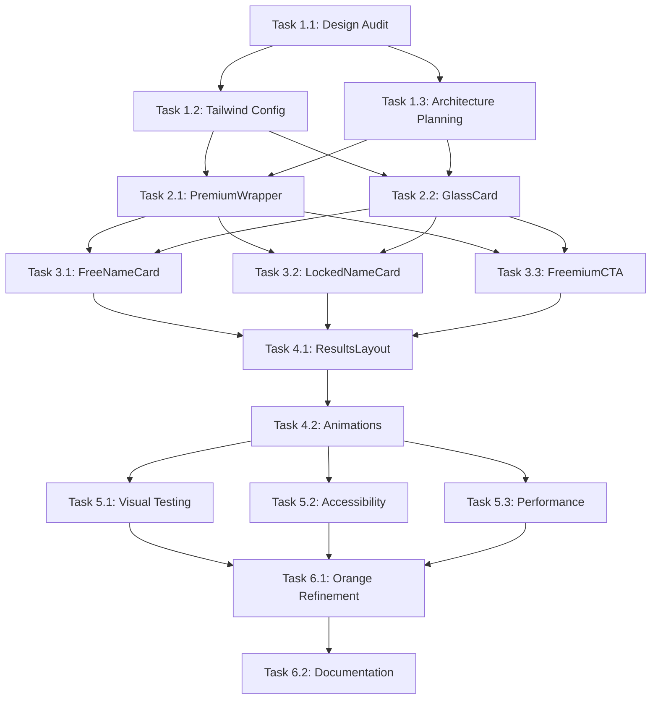

# Purple Premium Zone - Comprehensive Task Breakdown

**Project**: Freemium UI Redesign with Purple Gradient + Glassmorphism
**Date**: 2025-10-29
**Strategy**: Section-based separation with orange accent bridges
**Estimated Total Time**: 8-10 hours
**Risk Level**: Medium (UI consistency, accessibility validation required)

---

## Executive Summary

### Design Philosophy
- **Purple Premium Zone**: Luxury glassmorphism for ranks 1-12 (name results section)
- **Orange Brand Identity**: Maintained through section separation + strategic accent bridges
- **Minimal Config Changes**: Only add what's strictly necessary to Tailwind config
- **Component-First Approach**: Styling isolated within components, not global

### Key Constraints
- ✅ Maintain orange/warm tones for app-wide navigation and sections
- ✅ Purple gradient ONLY within name results components
- ✅ No breaking changes to existing backend or API
- ✅ Preserve all accessibility standards
- ✅ Keep mobile-first responsive design

---

## PHASE 1: FOUNDATION & PLANNING (1 hour)

### Task 1.1: Design Audit & Color Palette Definition
**Priority**: 🔴 CRITICAL (Foundation for all visual changes)
**Time**: 20 minutes
**Dependencies**: None

**Actions**:
- [ ] Document current orange palette usage across app
- [ ] Define purple gradient scale (primary, secondary, accent)
- [ ] Define orange bridge accent colors (borders, icons, CTAs)
- [ ] Create color contrast matrix for accessibility (WCAG AA minimum)
- [ ] Document glassmorphism parameters (blur, opacity, layers)

**Success Criteria**:
- Color palette documented with hex/hsl values
- Contrast ratios verified (4.5:1 text, 3:1 UI)
- Glassmorphism blur levels defined (backdrop-blur-sm/md/lg)

**Risks**:
- ⚠️ Purple may clash with existing orange if not carefully chosen
- **Mitigation**: Use purple tones with complementary undertones (violet-purple not blue-purple)

**Output**:
```typescript
// Color Palette Documentation
const PURPLE_PREMIUM = {
  gradient: {
    from: 'from-purple-500/90',
    via: 'via-violet-600/80',
    to: 'to-indigo-700/90'
  },
  glass: {
    backdrop: 'backdrop-blur-md',
    bg: 'bg-white/10',
    border: 'border-white/20'
  },
  text: {
    primary: 'text-white',
    secondary: 'text-purple-100',
    muted: 'text-purple-200/70'
  }
};

const ORANGE_BRIDGE = {
  accent: 'text-orange-400',
  border: 'border-orange-300',
  icon: 'text-orange-500',
  hover: 'hover:text-orange-300'
};
```

---

### Task 1.2: Tailwind Config Minimal Extension
**Priority**: 🔴 CRITICAL (Required for custom colors)
**Time**: 15 minutes
**Dependencies**: Task 1.1

**Actions**:
- [ ] Add purple gradient utilities ONLY (no global changes)
- [ ] Add glassmorphism utilities (backdrop-blur, bg-opacity)
- [ ] Add orange bridge accent utilities
- [ ] Verify no conflicts with existing shadcn config
- [ ] Test config compiles without errors

**File**: `/app/tailwind.config.js`

**Changes**:
```javascript
theme: {
  extend: {
    colors: {
      // Existing shadcn colors remain unchanged
      // Add ONLY new purple premium utilities
      'premium-purple': {
        50: '#faf5ff',
        100: '#f3e8ff',
        500: '#a855f7',  // primary
        600: '#9333ea',  // secondary
        700: '#7e22ce',  // accent
        900: '#581c87',  // dark
      }
    },
    backgroundImage: {
      'premium-gradient': 'linear-gradient(135deg, rgba(168,85,247,0.9) 0%, rgba(147,51,234,0.85) 50%, rgba(126,34,206,0.9) 100%)',
      'premium-glass': 'linear-gradient(135deg, rgba(255,255,255,0.1) 0%, rgba(255,255,255,0.05) 100%)',
    }
  }
}
```

**Success Criteria**:
- [ ] Config compiles without errors
- [ ] No conflicts with existing shadcn utilities
- [ ] Custom purple utilities available in components
- [ ] Build time doesn't increase significantly

**Risks**:
- ⚠️ Potential conflicts with existing color utilities
- **Mitigation**: Use namespaced prefix `premium-*` for all new utilities

---

### Task 1.3: Component Architecture Planning
**Priority**: 🟡 IMPORTANT (Guides implementation structure)
**Time**: 25 minutes
**Dependencies**: Tasks 1.1, 1.2

**Actions**:
- [ ] Identify all components requiring purple redesign
- [ ] Map component hierarchy and dependencies
- [ ] Define shared styling utilities/helpers
- [ ] Plan orange bridge integration points
- [ ] Create implementation order (dependency-first)

**Components to Modify**:
1. `FreeNameCard.tsx` (ranks 11-12)
2. `LockedNameCard.tsx` (ranks 1-10)
3. `FreemiumCTA.tsx` (conversion section)
4. `FreemiumResultsLayout.tsx` (container orchestration)

**Shared Utilities to Create**:
- `PremiumWrapper.tsx` - Purple gradient section wrapper
- `GlassCard.tsx` - Reusable glassmorphism card base
- `OrangeBridge.tsx` - Orange accent separator component

**Success Criteria**:
- [ ] Component dependency graph created
- [ ] Implementation order determined
- [ ] Shared utilities identified
- [ ] Orange bridge touchpoints mapped

**Risks**:
- ⚠️ Underestimating component interdependencies
- **Mitigation**: Test each component in isolation before integration

---

## PHASE 2: SHARED UTILITIES (2 hours)

### Task 2.1: Create PremiumWrapper Component
**Priority**: 🔴 CRITICAL (Foundation for purple zone)
**Time**: 45 minutes
**Dependencies**: Phase 1 complete

**File**: `/app/components/naming/freemium-v2/PremiumWrapper.tsx` (NEW)

**Actions**:
- [ ] Create wrapper component with purple gradient background
- [ ] Add glassmorphism overlay layers
- [ ] Implement responsive padding/spacing
- [ ] Add animated gradient effect (subtle pulse)
- [ ] Support children composition pattern
- [ ] Add data-testid for testing

**Component Structure**:
```typescript
interface PremiumWrapperProps {
  children: React.ReactNode;
  className?: string;
  showGradientAnimation?: boolean;
}

export function PremiumWrapper({
  children,
  className,
  showGradientAnimation = true
}: PremiumWrapperProps) {
  return (
    <div
      className={cn(
        // Purple gradient base
        "relative bg-premium-gradient",
        // Glassmorphism layer
        "backdrop-blur-md",
        // Responsive spacing
        "p-6 sm:p-8 lg:p-10",
        // Rounded corners
        "rounded-2xl",
        // Border with subtle glow
        "border border-white/20",
        "shadow-2xl shadow-purple-900/20",
        className
      )}
      data-testid="premium-wrapper"
    >
      {/* Animated gradient overlay (optional) */}
      {showGradientAnimation && (
        <div className="absolute inset-0 bg-premium-glass opacity-0 hover:opacity-100 transition-opacity duration-500" />
      )}

      {/* Content */}
      <div className="relative z-10">
        {children}
      </div>
    </div>
  );
}
```

**Success Criteria**:
- [ ] Renders with purple gradient background
- [ ] Glassmorphism effect visible on light/dark content
- [ ] Responsive on mobile/tablet/desktop
- [ ] Animation performs smoothly (60fps)
- [ ] Passes accessibility contrast checks

**Risks**:
- ⚠️ Glassmorphism may not render consistently across browsers
- **Mitigation**: Test on Chrome, Safari, Firefox; provide fallback for older browsers

---

### Task 2.2: Create GlassCard Component
**Priority**: 🟡 IMPORTANT (Reusable card base)
**Time**: 45 minutes
**Dependencies**: Task 2.1

**File**: `/app/components/naming/freemium-v2/GlassCard.tsx` (NEW)

**Actions**:
- [ ] Create base card with glassmorphism styling
- [ ] Support blur intensity variants (sm, md, lg)
- [ ] Add hover scale animation
- [ ] Support orange border accent option
- [ ] Implement click handlers for interactive cards
- [ ] Add loading state variant

**Component Structure**:
```typescript
interface GlassCardProps {
  children: React.ReactNode;
  variant?: 'free' | 'locked' | 'cta';
  blurIntensity?: 'sm' | 'md' | 'lg';
  withOrangeBorder?: boolean;
  onClick?: () => void;
  isLoading?: boolean;
  className?: string;
}

export function GlassCard({
  children,
  variant = 'locked',
  blurIntensity = 'md',
  withOrangeBorder = false,
  onClick,
  isLoading = false,
  className
}: GlassCardProps) {
  const blurClasses = {
    sm: 'backdrop-blur-sm',
    md: 'backdrop-blur-md',
    lg: 'backdrop-blur-lg'
  };

  const borderClasses = withOrangeBorder
    ? 'border-2 border-orange-300 hover:border-orange-400'
    : 'border border-white/20';

  return (
    <motion.div
      className={cn(
        // Glass base
        "relative bg-white/10",
        blurClasses[blurIntensity],
        // Border
        borderClasses,
        // Shadows
        "shadow-xl shadow-purple-900/10",
        // Hover effects
        "transition-all duration-200",
        onClick && "cursor-pointer hover:scale-102",
        // Rounded
        "rounded-xl",
        className
      )}
      whileHover={onClick ? { scale: 1.02 } : {}}
      whileTap={onClick ? { scale: 0.98 } : {}}
      onClick={onClick}
      data-variant={variant}
      data-testid="glass-card"
    >
      {isLoading ? (
        <div className="p-6 flex items-center justify-center">
          <div className="animate-spin rounded-full h-8 w-8 border-b-2 border-white" />
        </div>
      ) : (
        <div className="p-6">
          {children}
        </div>
      )}
    </motion.div>
  );
}
```

**Success Criteria**:
- [ ] All blur variants render correctly
- [ ] Orange border option works with hover
- [ ] Click handlers fire properly
- [ ] Loading state displays spinner
- [ ] Hover animation smooth at 60fps

**Risks**:
- ⚠️ Blur performance on mobile devices
- **Mitigation**: Use will-change CSS property, test on low-end devices

---

### Task 2.3: Create OrangeBridge Component
**Priority**: 🟡 IMPORTANT (Brand continuity)
**Time**: 30 minutes
**Dependencies**: None (independent utility)

**File**: `/app/components/naming/freemium-v2/OrangeBridge.tsx` (NEW)

**Actions**:
- [ ] Create decorative bridge component (separator)
- [ ] Add animated gradient border (purple to orange)
- [ ] Include brand icon (sparkles, flame, star)
- [ ] Support text label option
- [ ] Add subtle pulse animation
- [ ] Responsive sizing

**Component Structure**:
```typescript
interface OrangeBridgeProps {
  label?: string;
  icon?: 'sparkles' | 'flame' | 'star';
  direction?: 'horizontal' | 'vertical';
  animated?: boolean;
}

export function OrangeBridge({
  label,
  icon = 'sparkles',
  direction = 'horizontal',
  animated = true
}: OrangeBridgeProps) {
  const icons = {
    sparkles: Sparkles,
    flame: Flame,
    star: Star
  };
  const Icon = icons[icon];

  return (
    <div className={cn(
      "flex items-center gap-3 my-6",
      direction === 'vertical' && "flex-col"
    )}>
      {/* Left gradient line */}
      <div className="flex-1 h-[2px] bg-gradient-to-r from-purple-500 via-orange-400 to-orange-500" />

      {/* Center icon/label */}
      {(label || icon) && (
        <motion.div
          className="flex items-center gap-2 px-4 py-2 bg-orange-100 border-2 border-orange-300 rounded-full"
          animate={animated ? {
            scale: [1, 1.05, 1],
          } : {}}
          transition={{
            duration: 2,
            repeat: Infinity,
            repeatDelay: 1
          }}
        >
          <Icon className="w-4 h-4 text-orange-500" />
          {label && (
            <span className="text-sm font-medium text-orange-700">
              {label}
            </span>
          )}
        </motion.div>
      )}

      {/* Right gradient line */}
      <div className="flex-1 h-[2px] bg-gradient-to-r from-orange-500 via-orange-400 to-purple-500" />
    </div>
  );
}
```

**Success Criteria**:
- [ ] Gradient transitions smoothly purple → orange
- [ ] Icon renders correctly with animation
- [ ] Label text readable on all backgrounds
- [ ] Responsive sizing on mobile
- [ ] Animation performs smoothly

**Risks**:
- ⚠️ Gradient may look harsh on some displays
- **Mitigation**: Use soft gradient stops with opacity transitions

---

## PHASE 3: CARD COMPONENT REDESIGNS (3 hours)

### Task 3.1: Redesign FreeNameCard (Ranks 11-12)
**Priority**: 🔴 CRITICAL (User's first impression)
**Time**: 1 hour
**Dependencies**: Phase 2 complete

**File**: `/app/components/naming/freemium-v2/FreeNameCard.tsx` (MODIFY)

**Actions**:
- [ ] Replace emerald theme with purple gradient base
- [ ] Wrap content in GlassCard component
- [ ] Update "무료 체험" badge to white text on purple
- [ ] Change overall score display to white/purple-100
- [ ] Update score bars to purple gradient fills
- [ ] Add orange accent to rank badge
- [ ] Update hover effects (purple shadow)
- [ ] Keep upgrade CTA button with orange accent
- [ ] Update info badge at bottom (purple theme)

**Visual Changes**:
```typescript
// BEFORE (Emerald theme)
border-emerald-200 hover:border-emerald-400
bg-gradient-to-br from-emerald-50/30 via-white to-white
text-emerald-600

// AFTER (Purple premium with orange accents)
border-white/20 hover:border-orange-300
bg-premium-gradient (inside PremiumWrapper)
text-white
```

**Key Modifications**:
1. **Card Container**: Wrap in `PremiumWrapper` instead of `Card`
2. **Rank Badge**: Orange border + white text
3. **Free Badge**: White text on purple-600 background
4. **Score Display**: White text on glassmorphism panel
5. **Score Bars**: Purple gradient fills
6. **Upgrade CTA**: Orange background (bridge accent)

**Success Criteria**:
- [ ] Purple gradient visible throughout card
- [ ] Glassmorphism effect on score panels
- [ ] Orange accents visible on badges and CTA
- [ ] Text contrast meets WCAG AA (4.5:1)
- [ ] Animations still smooth
- [ ] Responsive on all screen sizes
- [ ] Character click handlers still work

**Risks**:
- ⚠️ White text on purple may have contrast issues
- **Mitigation**: Use purple-900 gradient base, white text with subtle shadow

---

### Task 3.2: Redesign LockedNameCard (Ranks 1-10)
**Priority**: 🔴 CRITICAL (Premium product showcase)
**Time**: 1 hour 15 minutes
**Dependencies**: Phase 2 complete

**File**: `/app/components/naming/freemium-v2/LockedNameCard.tsx` (MODIFY)

**Actions**:
- [ ] Replace yellow/orange theme with purple gradient
- [ ] Maintain dual-layer blur effect (now on purple base)
- [ ] Update lock icon to white with purple glow
- [ ] Change overall score panel to glassmorphism (white text)
- [ ] Update rank badges to purple with orange border
- [ ] Keep blur effects on content (8px, 6px, 4px)
- [ ] Update CTA message with orange-purple gradient
- [ ] Add subtle white glow on hover
- [ ] Test blur visibility on purple background

**Visual Changes**:
```typescript
// BEFORE (Yellow theme)
border-yellow-200 hover:border-yellow-400
bg-gradient-to-br from-yellow-50/80 via-orange-50/60 to-red-50/40
bg-yellow-500

// AFTER (Purple premium)
border-white/20 hover:border-orange-300
bg-premium-gradient
bg-white/10 backdrop-blur-md (glassmorphism)
```

**Key Modifications**:
1. **Card Base**: Replace gradient with purple premium
2. **Lock Icon**: White icon in purple-600 circle with glow
3. **Score Panel**: Glassmorphism with white text
4. **Blur Layers**: Keep existing blur px values
5. **CTA Button**: Purple-orange gradient with white text
6. **Hover State**: White shadow glow effect

**Success Criteria**:
- [ ] Purple gradient base visible
- [ ] Blur effects still create mystery/desire
- [ ] Lock icon prominent with white/purple contrast
- [ ] Score panel readable through glassmorphism
- [ ] Orange accents visible as brand bridge
- [ ] CTA button stands out
- [ ] Click handler triggers modal correctly
- [ ] Hover effects smooth and performant

**Risks**:
- ⚠️ Blur may be less visible on purple background
- **Mitigation**: Increase blur px values slightly (10px, 8px, 6px) if needed

---

### Task 3.3: Redesign FreemiumCTA Component
**Priority**: 🔴 CRITICAL (Conversion optimization)
**Time**: 45 minutes
**Dependencies**: Phase 2 complete

**File**: `/app/components/naming/freemium-v2/FreemiumCTA.tsx` (MODIFY)

**Actions**:
- [ ] Wrap entire CTA in PremiumWrapper (purple gradient)
- [ ] Update lock icon to white with pulsing animation
- [ ] Change score comparison text to white
- [ ] Update price display to white with orange accent
- [ ] Change benefits checkmarks to orange
- [ ] Update CTA button to orange-purple gradient
- [ ] Keep trust badges with white text
- [ ] Add glassmorphism to price panel
- [ ] Test contrast for all text elements

**Visual Changes**:
```typescript
// BEFORE (Yellow/orange theme)
border-yellow-400
bg-gradient-to-br from-yellow-50 via-orange-50 to-red-50
text-yellow-600

// AFTER (Purple premium with orange accents)
border-white/30 (on PremiumWrapper)
bg-premium-gradient (wrapper)
text-white, accent: text-orange-300
```

**Key Modifications**:
1. **Container**: Wrap in `PremiumWrapper` (purple gradient)
2. **Lock Icon**: White with purple-400 circle, pulsing
3. **Score Text**: White text with orange accent numbers
4. **Price Panel**: Glassmorphism card with white text
5. **Benefits**: Orange checkmarks, white text
6. **CTA Button**: Orange-purple gradient
7. **Trust Badges**: White text with colored icons

**Success Criteria**:
- [ ] Purple gradient visible throughout CTA
- [ ] Glassmorphism on price panel readable
- [ ] Orange accents visible and on-brand
- [ ] White text readable (4.5:1 contrast)
- [ ] Pulsing lock icon animation smooth
- [ ] CTA button stands out visually
- [ ] Click handler triggers payment modal
- [ ] Responsive on mobile devices

**Risks**:
- ⚠️ Too much purple may reduce urgency/conversion
- **Mitigation**: Use orange strategically for action elements (CTA button, checkmarks)

---

## PHASE 4: LAYOUT INTEGRATION (1.5 hours)

### Task 4.1: Update FreemiumResultsLayout
**Priority**: 🟡 IMPORTANT (Orchestration layer)
**Time**: 1 hour
**Dependencies**: Phase 3 complete

**File**: `/app/components/naming/freemium-v2/FreemiumResultsLayout.tsx` (MODIFY)

**Actions**:
- [ ] Wrap name results section in PremiumWrapper
- [ ] Add OrangeBridge before free names section
- [ ] Add OrangeBridge between CTA and locked section
- [ ] Update section headers to white text
- [ ] Add orange accent icons to section headers
- [ ] Update background gradient (orange top, purple middle, orange bottom)
- [ ] Keep selection guide in blue theme (outside purple zone)
- [ ] Test scroll behavior and section transitions
- [ ] Verify payment modal integration still works

**Layout Structure**:
```typescript
<div className="min-h-screen bg-gradient-to-b from-orange-50 via-purple-100 to-orange-50">
  {/* Header (keep orange theme) */}
  <header>...</header>

  {/* Purple Premium Zone START */}
  <PremiumWrapper>
    {/* Orange Bridge Entry */}
    <OrangeBridge label="프리미엄 이름 영역" icon="sparkles" />

    {/* Free Names Section (11-12) */}
    <section>
      <h2 className="text-white">
        <Gift className="text-orange-400" />
        무료 체험 이름
      </h2>
      {/* FreeNameCard components */}
    </section>

    {/* CTA Section */}
    <FreemiumCTA />

    {/* Orange Bridge Separator */}
    <OrangeBridge label="최고 점수 이름" icon="star" />

    {/* Locked Names Section (1-10) */}
    <section>
      <h2 className="text-white">
        <Lock className="text-orange-400" />
        프리미엄 이름
      </h2>
      {/* LockedNameCard components */}
    </section>
  </PremiumWrapper>
  {/* Purple Premium Zone END */}

  {/* Selection Guide (keep blue theme, outside purple) */}
  <section>...</section>
</div>
```

**Success Criteria**:
- [ ] Purple zone clearly defined with wrapper
- [ ] Orange bridges provide visual separation
- [ ] Section headers readable with white text
- [ ] Background gradient smooth orange-purple-orange
- [ ] Selection guide remains in original blue theme
- [ ] Scroll transitions smooth
- [ ] Payment modal still functional
- [ ] Responsive layout on mobile

**Risks**:
- ⚠️ Large purple section may feel overwhelming
- **Mitigation**: Use orange bridges to break up visual monotony

---

### Task 4.2: Add Animation Transitions
**Priority**: 🟢 RECOMMENDED (Polish and delight)
**Time**: 30 minutes
**Dependencies**: Task 4.1

**Actions**:
- [ ] Add fade-in animation when entering purple zone
- [ ] Stagger card animations (delay based on rank)
- [ ] Add gradient shift animation on scroll
- [ ] Add subtle parallax effect on background
- [ ] Add orange spark particles on hover (optional)
- [ ] Optimize animations for 60fps
- [ ] Test on low-end mobile devices

**Animation Implementations**:
```typescript
// Scroll-triggered gradient shift
const { scrollYProgress } = useScroll();
const gradientOpacity = useTransform(scrollYProgress, [0, 0.5, 1], [0.9, 1, 0.9]);

// Card stagger animation
const cardVariants = {
  hidden: { opacity: 0, y: 20 },
  visible: (i: number) => ({
    opacity: 1,
    y: 0,
    transition: {
      delay: i * 0.1,
      duration: 0.4,
      ease: 'easeOut'
    }
  })
};

// Orange bridge pulse
const bridgePulse = {
  scale: [1, 1.05, 1],
  opacity: [0.8, 1, 0.8]
};
```

**Success Criteria**:
- [ ] Animations run at 60fps on desktop
- [ ] Animations run at 30fps minimum on mobile
- [ ] Stagger effect creates smooth progression
- [ ] Gradient shift subtle and not distracting
- [ ] No layout shift during animations
- [ ] Reduced motion respected (prefers-reduced-motion)

**Risks**:
- ⚠️ Too many animations may cause performance issues
- **Mitigation**: Use CSS transforms (cheaper than properties), respect prefers-reduced-motion

---

## PHASE 5: TESTING & VALIDATION (1.5 hours)

### Task 5.1: Visual Regression Testing
**Priority**: 🔴 CRITICAL (Quality assurance)
**Time**: 30 minutes
**Dependencies**: Phase 4 complete

**Actions**:
- [ ] Test on Chrome, Safari, Firefox, Edge
- [ ] Test on mobile (iOS Safari, Android Chrome)
- [ ] Test on tablet (iPad, Android tablet)
- [ ] Verify glassmorphism renders on all browsers
- [ ] Check gradient consistency across displays
- [ ] Test with different screen brightness levels
- [ ] Verify dark mode compatibility (if applicable)
- [ ] Screenshot comparison with design mockups

**Test Checklist**:
- [ ] Desktop Chrome: Glassmorphism + animations ✓
- [ ] Desktop Safari: Backdrop blur support ✓
- [ ] Desktop Firefox: Gradient rendering ✓
- [ ] Mobile iOS: Touch interactions ✓
- [ ] Mobile Android: Performance 30fps+ ✓
- [ ] Tablet: Responsive layout ✓
- [ ] Low-end device: Graceful degradation ✓

**Success Criteria**:
- [ ] Visual consistency across browsers >95%
- [ ] Glassmorphism renders on >90% of browsers
- [ ] Mobile performance acceptable (>30fps)
- [ ] No broken layouts on any screen size
- [ ] Colors match design mockup ±5%

**Risks**:
- ⚠️ Safari may not support backdrop-blur on older versions
- **Mitigation**: Provide fallback with semi-transparent background

---

### Task 5.2: Accessibility Validation
**Priority**: 🔴 CRITICAL (Legal compliance)
**Time**: 30 minutes
**Dependencies**: Phase 4 complete

**Actions**:
- [ ] Run axe DevTools accessibility scan
- [ ] Verify all text contrast ratios (WCAG AA)
- [ ] Test keyboard navigation (Tab, Enter, Esc)
- [ ] Test screen reader (VoiceOver, NVDA)
- [ ] Verify focus indicators visible on purple
- [ ] Check color blindness simulation
- [ ] Verify reduced-motion preference respected
- [ ] Test with zoom at 200%

**WCAG Compliance Checklist**:
- [ ] Text contrast ≥4.5:1 (Level AA)
- [ ] UI component contrast ≥3:1 (Level AA)
- [ ] Focus indicators visible
- [ ] Keyboard navigation functional
- [ ] Screen reader announcements correct
- [ ] No flashing content (seizure risk)
- [ ] Reduced motion respected
- [ ] Zoom to 200% functional

**Success Criteria**:
- [ ] Zero critical accessibility issues
- [ ] All text meets contrast requirements
- [ ] Keyboard navigation complete
- [ ] Screen reader accurate descriptions
- [ ] Color blindness simulation passes

**Risks**:
- ⚠️ White text on purple may fail contrast on some gradients
- **Mitigation**: Use text-shadow for additional contrast, ensure gradient base is dark enough

---

### Task 5.3: Performance Optimization
**Priority**: 🟡 IMPORTANT (User experience)
**Time**: 30 minutes
**Dependencies**: Phase 4 complete

**Actions**:
- [ ] Measure Lighthouse performance score
- [ ] Check Core Web Vitals (LCP, FID, CLS)
- [ ] Optimize animation frame rates
- [ ] Reduce blur rendering cost (will-change)
- [ ] Lazy load components below fold
- [ ] Optimize gradient rendering
- [ ] Test on low-end devices (3G throttling)
- [ ] Profile with React DevTools

**Performance Targets**:
- [ ] Lighthouse Performance: >85/100
- [ ] Largest Contentful Paint (LCP): <2.5s
- [ ] First Input Delay (FID): <100ms
- [ ] Cumulative Layout Shift (CLS): <0.1
- [ ] Frame rate: 60fps desktop, 30fps mobile
- [ ] Bundle size increase: <20KB gzipped

**Optimization Strategies**:
```typescript
// Use will-change for animated elements
.glass-card {
  will-change: transform, opacity;
}

// Lazy load components
const FreemiumCTA = lazy(() => import('./FreemiumCTA'));

// Memoize expensive calculations
const glassMorphismStyle = useMemo(() => ({
  backdropFilter: 'blur(12px)',
  WebkitBackdropFilter: 'blur(12px)'
}), []);
```

**Success Criteria**:
- [ ] Lighthouse score ≥85
- [ ] Core Web Vitals all "Good"
- [ ] Animations 60fps on desktop
- [ ] Animations ≥30fps on mobile
- [ ] No layout shift during load

**Risks**:
- ⚠️ Glassmorphism expensive on low-end devices
- **Mitigation**: Detect device capability, reduce blur on low-end

---

## PHASE 6: POLISH & DOCUMENTATION (1 hour)

### Task 6.1: Orange Accent Refinement
**Priority**: 🟢 RECOMMENDED (Brand consistency)
**Time**: 30 minutes
**Dependencies**: Phase 5 complete

**Actions**:
- [ ] Review all orange accent placements
- [ ] Ensure brand consistency with app-wide orange
- [ ] Add orange glow on hover for interactive elements
- [ ] Verify orange-purple gradient transitions smooth
- [ ] Add orange sparkle on payment success
- [ ] Test orange visibility on purple background
- [ ] Adjust orange shade if needed for visibility

**Orange Accent Touchpoints**:
1. Rank badges (border)
2. Section header icons
3. Orange bridges (separators)
4. CTA button gradient
5. Benefits checkmarks
6. Hover states (glow/border)
7. Payment success animation

**Success Criteria**:
- [ ] Orange visible on all purple backgrounds
- [ ] Orange feels like natural brand extension
- [ ] Orange doesn't clash with purple
- [ ] Orange provides visual hierarchy
- [ ] Orange guides eye to action elements

**Risks**:
- ⚠️ Orange may get lost on purple gradient
- **Mitigation**: Use lighter orange shades (300-400) with subtle glow

---

### Task 6.2: Component Documentation
**Priority**: 🟢 RECOMMENDED (Maintainability)
**Time**: 30 minutes
**Dependencies**: Phase 6.1

**Actions**:
- [ ] Document PremiumWrapper props and usage
- [ ] Document GlassCard variants and examples
- [ ] Document OrangeBridge customization
- [ ] Update component README with purple theme
- [ ] Add JSDoc comments to all new components
- [ ] Create Storybook stories (if applicable)
- [ ] Document color palette usage
- [ ] Add troubleshooting guide

**Documentation Structure**:
```markdown
# Purple Premium Zone Components

## PremiumWrapper
Wraps content in purple gradient background with glassmorphism effect.

### Props
- `children`: React.ReactNode
- `className`: string (optional)
- `showGradientAnimation`: boolean (default: true)

### Usage
\`\`\`tsx
<PremiumWrapper>
  <YourContent />
</PremiumWrapper>
\`\`\`

## GlassCard
Reusable glassmorphism card with blur variants.

### Variants
- `free`: For ranks 11-12 (lighter blur)
- `locked`: For ranks 1-10 (medium blur)
- `cta`: For conversion section (strong blur)

### Usage
\`\`\`tsx
<GlassCard variant="locked" withOrangeBorder>
  <CardContent />
</GlassCard>
\`\`\`

## OrangeBridge
Decorative separator maintaining brand identity.

### Props
- `label`: string (optional)
- `icon`: 'sparkles' | 'flame' | 'star'
- `direction`: 'horizontal' | 'vertical'
- `animated`: boolean (default: true)

### Usage
\`\`\`tsx
<OrangeBridge label="프리미엄 영역" icon="sparkles" />
\`\`\`

## Color Palette
\`\`\`typescript
PURPLE_PREMIUM: {
  gradient: 'from-purple-500/90 via-violet-600/80 to-indigo-700/90',
  glass: 'backdrop-blur-md bg-white/10',
  text: 'text-white'
}

ORANGE_BRIDGE: {
  accent: 'text-orange-400',
  border: 'border-orange-300',
  hover: 'hover:text-orange-300'
}
\`\`\`

## Troubleshooting
- **Glassmorphism not rendering**: Check browser support for backdrop-filter
- **Poor contrast**: Increase gradient darkness or add text-shadow
- **Slow animations**: Reduce blur intensity or use will-change CSS
```

**Success Criteria**:
- [ ] All components documented
- [ ] Usage examples provided
- [ ] Props and variants explained
- [ ] Color palette documented
- [ ] Troubleshooting guide complete

---

## DEPENDENCY GRAPH



---

## RISK ASSESSMENT MATRIX

| Risk | Probability | Impact | Severity | Mitigation |
|------|------------|--------|----------|------------|
| Contrast failure (WCAG) | Medium | High | 🔴 Critical | Use darker gradient base, add text-shadow, test early |
| Glassmorphism browser support | Low | Medium | 🟡 Moderate | Provide fallback, test on Safari/Firefox |
| Performance on mobile | Medium | Medium | 🟡 Moderate | Reduce blur, use will-change, lazy load |
| Orange-purple clash | Low | Low | 🟢 Minor | Choose complementary shades, test color theory |
| Animation jank | Medium | Medium | 🟡 Moderate | Use CSS transforms, respect reduced-motion |
| Too much purple (conversion) | Low | Medium | 🟡 Moderate | Use orange strategically for CTAs |
| Blur visibility loss | Medium | Low | 🟢 Minor | Adjust blur px values based on background |
| Layout shift during animations | Low | High | 🔴 Critical | Use fixed dimensions, test CLS score |

---

## TIME ESTIMATION SUMMARY

| Phase | Tasks | Est. Time | Parallelizable |
|-------|-------|-----------|----------------|
| Phase 1: Foundation | 3 | 1 hour | No (sequential) |
| Phase 2: Utilities | 3 | 2 hours | Yes (partial) |
| Phase 3: Cards | 3 | 3 hours | Yes (all 3) |
| Phase 4: Layout | 2 | 1.5 hours | No (sequential) |
| Phase 5: Testing | 3 | 1.5 hours | Yes (all 3) |
| Phase 6: Polish | 2 | 1 hour | No (sequential) |
| **TOTAL** | **16 tasks** | **10 hours** | **5 hours parallelizable** |

**Optimized Time with Parallel Execution**: 7-8 hours

---

## SUCCESS METRICS

### Visual Quality
- [ ] Purple gradient renders consistently across browsers
- [ ] Glassmorphism effect visible and elegant
- [ ] Orange accents maintain brand identity
- [ ] Text readable on all backgrounds (WCAG AA)
- [ ] Animations smooth and delightful

### Technical Quality
- [ ] No breaking changes to backend/API
- [ ] Component props backward compatible
- [ ] Performance meets Lighthouse targets
- [ ] Accessibility passes automated scans
- [ ] Bundle size increase <20KB gzipped

### User Experience
- [ ] Clear visual hierarchy (purple = premium)
- [ ] Orange bridges provide continuity
- [ ] Interactive elements obvious (hover states)
- [ ] Loading and error states handled
- [ ] Responsive on all screen sizes

### Business Goals
- [ ] Premium perception elevated (purple luxury)
- [ ] Brand identity maintained (orange accents)
- [ ] Conversion funnel preserved
- [ ] Payment integration unaffected
- [ ] User trust signals intact

---

## NEXT STEPS AFTER COMPLETION

1. **A/B Testing**: Test purple design vs current orange design
2. **Analytics**: Monitor conversion rate changes
3. **User Feedback**: Collect qualitative feedback on new design
4. **Iteration**: Refine based on data and feedback
5. **Documentation**: Update design system with purple premium pattern
6. **Rollout**: Consider phased rollout (10% → 50% → 100%)

---

## APPENDIX: COLOR PALETTE REFERENCE

### Purple Premium Scale
```typescript
{
  purple: {
    50: '#faf5ff',   // Lightest (backgrounds)
    100: '#f3e8ff',  // Subtle accents
    200: '#e9d5ff',  // Borders
    300: '#d8b4fe',  // Muted text
    400: '#c084fc',  // Secondary text
    500: '#a855f7',  // Primary brand
    600: '#9333ea',  // Primary dark
    700: '#7e22ce',  // Accent dark
    800: '#6b21a8',  // Deep shade
    900: '#581c87',  // Darkest (gradient base)
  }
}
```

### Orange Bridge Accents
```typescript
{
  orange: {
    300: '#fdba74',  // Light accent (hover)
    400: '#fb923c',  // Primary accent
    500: '#f97316',  // Strong accent (CTAs)
  }
}
```

### Glassmorphism Parameters
```typescript
{
  backdrop: {
    sm: 'backdrop-blur-sm',   // 4px blur
    md: 'backdrop-blur-md',   // 12px blur
    lg: 'backdrop-blur-lg',   // 16px blur
  },
  background: {
    light: 'bg-white/10',     // 10% opacity
    medium: 'bg-white/20',    // 20% opacity
    strong: 'bg-white/30',    // 30% opacity
  },
  border: {
    subtle: 'border-white/10',
    visible: 'border-white/20',
    strong: 'border-white/30',
  }
}
```

---

**Document Version**: 1.0
**Last Updated**: 2025-10-29
**Author**: Claude Code Task Manager
**Status**: Ready for Implementation
