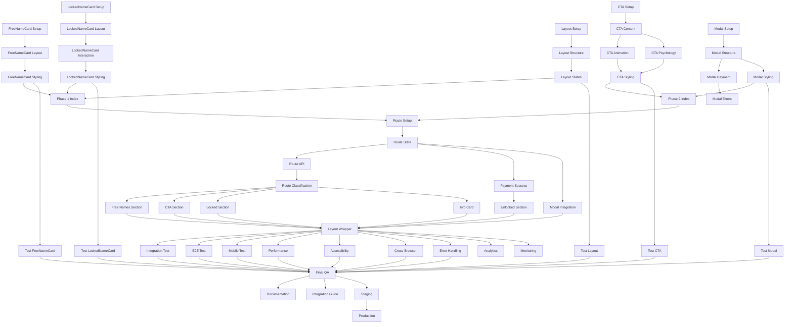

# Freemium V2 - Detailed Task Breakdown

**Project**: freemium-v2 naming results system
**Based on**: Sequential thinking plan at `/claudedocs/freemium-v2-sequential-plan.md`
**Timeline**: 4-5 days (MVP + testing)
**Total Estimated Tasks**: 47 tasks

---

## Task Hierarchy Overview

```
PROJECT: freemium-v2
├─ PHASE 1: Foundation Components (Day 1) - 11 tasks
├─ PHASE 2: Conversion Components (Day 2) - 11 tasks
├─ PHASE 3: Route Integration (Day 3) - 12 tasks
├─ PHASE 4: Testing & Polish (Day 4) - 13 tasks
└─ PHASE 5: Documentation & Launch (Optional) - 6 tasks
```

---

## PHASE 1: Foundation Components (Day 1)

**Priority**: HIGH | **Estimated Time**: 6 hours

### TASK 1.1: FreeNameCard - Setup & Types
**ID**: `FV2-001`
**Priority**: HIGH
**Estimated**: 30 min
**Dependencies**: None
**Status**: Pending

**Subtasks**:
- [ ] Create file: `app/components/naming/freemium-v2/FreeNameCard.tsx`
- [ ] Define `FreeNameCardProps` interface
- [ ] Import required types from `~/lib/naming/types`
- [ ] Set up component structure with TypeScript
- [ ] Add JSDoc documentation

**Acceptance Criteria**:
- TypeScript compiles without errors
- Props interface includes: `candidate`, `rank`, `onCharacterClick?`
- Component exports correctly

---

### TASK 1.2: FreeNameCard - Layout Structure
**ID**: `FV2-002`
**Priority**: HIGH
**Estimated**: 45 min
**Dependencies**: `FV2-001`
**Status**: Pending

**Subtasks**:
- [ ] Implement Card wrapper with shadow
- [ ] Create header section with rank badge
- [ ] Add "무료 공개" badge (green theme)
- [ ] Structure name and hanja display section
- [ ] Create score breakdown grid (4 categories)
- [ ] Add element badges section
- [ ] Implement stroke count display
- [ ] Add confidence score indicator

**Acceptance Criteria**:
- All sections render correctly
- Layout is responsive (mobile + desktop)
- Green color scheme applied

---

### TASK 1.3: FreeNameCard - Styling & Animation
**ID**: `FV2-003`
**Priority**: MEDIUM
**Estimated**: 45 min
**Dependencies**: `FV2-002`
**Status**: Pending

**Subtasks**:
- [ ] Apply Tailwind classes for green theme
- [ ] Add shadow and border styling
- [ ] Implement hover effects
- [ ] Add framer-motion entrance animation
- [ ] Apply responsive padding/spacing
- [ ] Test on mobile devices

**Acceptance Criteria**:
- Smooth animations (60fps)
- Mobile responsive
- Matches design tokens from sequential plan

---

### TASK 1.4: LockedNameCard - Setup & Types
**ID**: `FV2-004`
**Priority**: HIGH
**Estimated**: 30 min
**Dependencies**: None
**Status**: Pending

**Subtasks**:
- [ ] Create file: `app/components/naming/freemium-v2/LockedNameCard.tsx`
- [ ] Define `LockedNameCardProps` interface
- [ ] Import required types and utilities
- [ ] Set up component structure
- [ ] Add JSDoc documentation

**Acceptance Criteria**:
- Props include: `candidate`, `rank`, `scoreDifference`, `onClick`
- TypeScript compiles correctly
- Component exports properly

---

### TASK 1.5: LockedNameCard - Layout & Blur Effect
**ID**: `FV2-005`
**Priority**: HIGH
**Estimated**: 1 hour
**Dependencies**: `FV2-004`
**Status**: Pending

**Subtasks**:
- [ ] Implement Card wrapper with premium styling
- [ ] Create header with rank badge (1-10위)
- [ ] Add lock icon badge (top-right, z-index: 20)
- [ ] Implement name/hanja section with blur(8px)
- [ ] Create score section (unblurred, z-index: 20)
- [ ] Add score detail section with blur(4px)
- [ ] Implement CTA section "클릭하여 확인" (unblurred)
- [ ] Add price display "₩69,000"

**Acceptance Criteria**:
- Blur effect works correctly (name/hanja = 8px, details = 4px)
- Score and CTA sections remain clear (no blur)
- Lock icon visible above blur layer

---

### TASK 1.6: LockedNameCard - Interaction & Animation
**ID**: `FV2-006`
**Priority**: MEDIUM
**Estimated**: 45 min
**Dependencies**: `FV2-005`
**Status**: Pending

**Subtasks**:
- [ ] Add onClick handler
- [ ] Implement hover animation (scale + shadow)
- [ ] Add framer-motion entrance animation
- [ ] Implement cursor pointer on hover
- [ ] Add tap animation for mobile
- [ ] Test click interaction

**Acceptance Criteria**:
- Card responds to clicks (opens payment modal)
- Hover effects smooth and performant
- Mobile touch interactions work

---

### TASK 1.7: LockedNameCard - Styling
**ID**: `FV2-007`
**Priority**: MEDIUM
**Estimated**: 30 min
**Dependencies**: `FV2-006`
**Status**: Pending

**Subtasks**:
- [ ] Apply yellow/gold color scheme
- [ ] Add premium gradient backgrounds
- [ ] Style rank badges (special for top 3)
- [ ] Apply responsive styling
- [ ] Test on different screen sizes

**Acceptance Criteria**:
- Premium theme clearly distinguished from free cards
- Responsive on mobile and desktop
- Matches design tokens

---

### TASK 1.8: FreemiumResultsLayout - Setup & Types
**ID**: `FV2-008`
**Priority**: MEDIUM
**Estimated**: 20 min
**Dependencies**: None
**Status**: Pending

**Subtasks**:
- [ ] Create file: `app/components/naming/freemium-v2/FreemiumResultsLayout.tsx`
- [ ] Define `FreemiumResultsLayoutProps` interface
- [ ] Set up component structure
- [ ] Add JSDoc documentation

**Acceptance Criteria**:
- Props include: `children`, `stage`, `sessionId?`, `metrics?`
- Component exports correctly

---

### TASK 1.9: FreemiumResultsLayout - Layout Structure
**ID**: `FV2-009`
**Priority**: MEDIUM
**Estimated**: 45 min
**Dependencies**: `FV2-008`
**Status**: Pending

**Subtasks**:
- [ ] Implement gradient background (orange-50 → white)
- [ ] Create max-width container (max-w-4xl)
- [ ] Add header with progress indicator (Step 3 of 3)
- [ ] Implement loading state skeleton
- [ ] Create error state with retry button
- [ ] Set up results state wrapper
- [ ] Add responsive padding

**Acceptance Criteria**:
- All three states render correctly (loading, error, results)
- Container properly centered and responsive
- Progress indicator shows "Step 3 of 3"

---

### TASK 1.10: FreemiumResultsLayout - States & Styling
**ID**: `FV2-010`
**Priority**: MEDIUM
**Estimated**: 30 min
**Dependencies**: `FV2-009`
**Status**: Pending

**Subtasks**:
- [ ] Style loading skeleton
- [ ] Style error card with retry button
- [ ] Apply gradient background
- [ ] Test state transitions
- [ ] Verify responsive design

**Acceptance Criteria**:
- Smooth transitions between states
- Loading skeleton matches card dimensions
- Error state is user-friendly

---

### TASK 1.11: Phase 1 - Component Index
**ID**: `FV2-011`
**Priority**: LOW
**Estimated**: 10 min
**Dependencies**: `FV2-003`, `FV2-007`, `FV2-010`
**Status**: Pending

**Subtasks**:
- [ ] Create `app/components/naming/freemium-v2/index.ts`
- [ ] Export FreeNameCard
- [ ] Export LockedNameCard
- [ ] Export FreemiumResultsLayout
- [ ] Verify imports work correctly

**Acceptance Criteria**:
- All components can be imported from single index
- TypeScript types export correctly

---

## PHASE 2: Conversion Components (Day 2)

**Priority**: HIGH | **Estimated Time**: 7 hours

### TASK 2.1: FreemiumCTA - Setup & Types
**ID**: `FV2-012`
**Priority**: HIGH
**Estimated**: 20 min
**Dependencies**: None
**Status**: Pending

**Subtasks**:
- [ ] Create file: `app/components/naming/freemium-v2/FreemiumCTA.tsx`
- [ ] Define `FreemiumCTAProps` interface
- [ ] Import PsychologicalMetrics type
- [ ] Set up component structure
- [ ] Add JSDoc documentation

**Acceptance Criteria**:
- Props include: `metrics`, `onPayment`
- TypeScript compiles correctly

---

### TASK 2.2: FreemiumCTA - Content Structure
**ID**: `FV2-013`
**Priority**: HIGH
**Estimated**: 1 hour
**Dependencies**: `FV2-012`
**Status**: Pending

**Subtasks**:
- [ ] Create Card wrapper with gradient background
- [ ] Implement lock icon with pulse animation
- [ ] Add main headline: "1위 최고 점수 {score}점"
- [ ] Display score difference: "+{diff}점 더 높은"
- [ ] Show price with strikethrough: ₩99,000 → ₩69,000
- [ ] Create benefits list (3-4 items with checkmarks)
- [ ] Add large CTA button
- [ ] Implement trust signals section

**Acceptance Criteria**:
- All content sections render correctly
- Dynamic values populate from metrics prop
- Layout is visually appealing

---

### TASK 2.3: FreemiumCTA - Gradient Animation
**ID**: `FV2-014`
**Priority**: MEDIUM
**Estimated**: 45 min
**Dependencies**: `FV2-013`
**Status**: Pending

**Subtasks**:
- [ ] Implement animated gradient background
- [ ] Create gradient flow effect (yellow → orange → red)
- [ ] Add lock icon pulse animation
- [ ] Implement entrance animation (scale + fade)
- [ ] Add hover effect on CTA button
- [ ] Test animation performance (60fps)

**Acceptance Criteria**:
- Gradient flows continuously
- Lock pulses periodically
- Animations smooth on all devices

---

### TASK 2.4: FreemiumCTA - Conversion Psychology
**ID**: `FV2-015`
**Priority**: HIGH
**Estimated**: 45 min
**Dependencies**: `FV2-013`
**Status**: Pending

**Subtasks**:
- [ ] Implement score anchoring (top score display)
- [ ] Add contrast messaging (score difference)
- [ ] Display scarcity ("단 10개 프리미엄")
- [ ] Show value framing ("이름당 ₩6,900")
- [ ] Add urgency messaging ("평생 사용할 이름")
- [ ] Include social proof ("전문가 검증")
- [ ] Display risk reversal ("환불 보장")

**Acceptance Criteria**:
- All psychological triggers present
- Messages dynamically generated from metrics
- Copy is compelling and clear

---

### TASK 2.5: FreemiumCTA - Styling & Mobile
**ID**: `FV2-016`
**Priority**: MEDIUM
**Estimated**: 30 min
**Dependencies**: `FV2-014`
**Status**: Pending

**Subtasks**:
- [ ] Apply gradient color scheme
- [ ] Style CTA button with gradient
- [ ] Apply responsive design
- [ ] Test on mobile devices
- [ ] Optimize for touch interactions

**Acceptance Criteria**:
- CTA stands out visually
- Mobile responsive
- Touch targets adequate (44x44px minimum)

---

### TASK 2.6: FreemiumPaymentModal - Setup & Types
**ID**: `FV2-017`
**Priority**: HIGH
**Estimated**: 30 min
**Dependencies**: None
**Status**: Pending

**Subtasks**:
- [ ] Create file: `app/components/naming/freemium-v2/FreemiumPaymentModal.tsx`
- [ ] Define `FreemiumPaymentModalProps` interface
- [ ] Import Dialog component from ui
- [ ] Import payment utilities
- [ ] Set up component structure
- [ ] Add JSDoc documentation

**Acceptance Criteria**:
- Props include: `isOpen`, `onClose`, `sessionId`, `amount`, `metrics`, `onSuccess?`
- TypeScript compiles correctly

---

### TASK 2.7: FreemiumPaymentModal - Modal Structure
**ID**: `FV2-018`
**Priority**: HIGH
**Estimated**: 1 hour
**Dependencies**: `FV2-017`
**Status**: Pending

**Subtasks**:
- [ ] Implement Dialog wrapper
- [ ] Create modal header with close button
- [ ] Add product summary section
- [ ] Display price (₩69,000)
- [ ] Create benefits list
- [ ] Add TossPayments logo/trust signal
- [ ] Implement primary CTA button
- [ ] Add cancel button
- [ ] Create loading state overlay

**Acceptance Criteria**:
- Modal opens/closes correctly
- All sections render properly
- Loading state covers modal during processing

---

### TASK 2.8: FreemiumPaymentModal - Payment Integration
**ID**: `FV2-019`
**Priority**: HIGH
**Estimated**: 1.5 hours
**Dependencies**: `FV2-018`
**Status**: Pending

**Subtasks**:
- [ ] Implement payment API call (`/api/payment/naming`)
- [ ] Handle API response (checkoutUrl, orderId)
- [ ] Implement redirect to TossPayments
- [ ] Add loading state during API call
- [ ] Close modal before redirect
- [ ] Implement success callback
- [ ] Add comprehensive error handling

**Acceptance Criteria**:
- API call succeeds with valid sessionId
- Redirect to TossPayments works
- Modal closes before redirect
- Errors handled gracefully

---

### TASK 2.9: FreemiumPaymentModal - Error Handling
**ID**: `FV2-020`
**Priority**: HIGH
**Estimated**: 45 min
**Dependencies**: `FV2-019`
**Status**: Pending

**Subtasks**:
- [ ] Add try-catch around API call
- [ ] Implement toast error notifications
- [ ] Handle network failures
- [ ] Handle API errors (400, 500, etc.)
- [ ] Handle invalid sessionId
- [ ] Add retry mechanism
- [ ] Test error scenarios

**Acceptance Criteria**:
- All error types handled
- User-friendly error messages
- Retry mechanism works
- No unhandled promise rejections

---

### TASK 2.10: FreemiumPaymentModal - Styling
**ID**: `FV2-021`
**Priority**: MEDIUM
**Estimated**: 30 min
**Dependencies**: `FV2-018`
**Status**: Pending

**Subtasks**:
- [ ] Style modal container
- [ ] Style product summary section
- [ ] Apply button styling (gradient CTA)
- [ ] Style benefits list
- [ ] Apply responsive design
- [ ] Test on mobile (full-screen on small devices)

**Acceptance Criteria**:
- Modal visually appealing
- Mobile responsive (full-screen on mobile)
- CTA button prominent

---

### TASK 2.11: Phase 2 - Update Index
**ID**: `FV2-022`
**Priority**: LOW
**Estimated**: 5 min
**Dependencies**: `FV2-016`, `FV2-021`
**Status**: Pending

**Subtasks**:
- [ ] Update `app/components/naming/freemium-v2/index.ts`
- [ ] Export FreemiumCTA
- [ ] Export FreemiumPaymentModal
- [ ] Verify imports work

**Acceptance Criteria**:
- All components exportable from index
- TypeScript types export correctly

---

## PHASE 3: Route Integration (Day 3)

**Priority**: HIGH | **Estimated Time**: 8 hours

### TASK 3.1: Route File - Setup & Types
**ID**: `FV2-023`
**Priority**: HIGH
**Estimated**: 30 min
**Dependencies**: None
**Status**: Pending

**Subtasks**:
- [ ] Create file: `app/routes/naming.freemium-v2.results.tsx`
- [ ] Import all components from freemium-v2
- [ ] Import classification utilities
- [ ] Import necessary types
- [ ] Define local types (NameRecommendation, Stage3Response)
- [ ] Add route-level JSDoc

**Acceptance Criteria**:
- All imports resolve correctly
- TypeScript compiles without errors
- Route file structure set up

---

### TASK 3.2: Route - State Management Setup
**ID**: `FV2-024`
**Priority**: HIGH
**Estimated**: 30 min
**Dependencies**: `FV2-023`
**Status**: Pending

**Subtasks**:
- [ ] Set up useState hooks (8 state variables)
- [ ] Extract URL params (sessionId, payment status)
- [ ] Set up useSearchParams hook
- [ ] Initialize all state variables
- [ ] Add TypeScript types for state

**Acceptance Criteria**:
- All state hooks initialized correctly
- URL params extracted successfully
- State management structure clear

---

### TASK 3.3: Route - API Integration
**ID**: `FV2-025`
**Priority**: HIGH
**Estimated**: 1.5 hours
**Dependencies**: `FV2-024`
**Status**: Pending

**Subtasks**:
- [ ] Implement useEffect for data fetching
- [ ] Create fetch call to `/api/naming/freemium`
- [ ] Handle API response (Stage3Response)
- [ ] Transform API data to ScoredCandidate[]
- [ ] Implement error handling
- [ ] Add loading state management
- [ ] Handle missing sessionId

**Acceptance Criteria**:
- API call succeeds with valid sessionId
- Response correctly transformed to ScoredCandidate[]
- Errors handled and displayed to user
- Loading state displays while fetching

---

### TASK 3.4: Route - Classification Integration
**ID**: `FV2-026`
**Priority**: HIGH
**Estimated**: 45 min
**Dependencies**: `FV2-025`
**Status**: Pending

**Subtasks**:
- [ ] Import classifyCandidates from classification.ts
- [ ] Import calculatePsychologicalMetrics
- [ ] Call classifyCandidates on fetched data
- [ ] Store tiers in state
- [ ] Calculate psychological metrics
- [ ] Store metrics in state
- [ ] Verify classification works correctly

**Acceptance Criteria**:
- 11-12위 names in free tier
- 1-10위 names in locked tier
- Metrics calculated correctly
- State updated with classification results

---

### TASK 3.5: Route - Payment Success Handling
**ID**: `FV2-027`
**Priority**: HIGH
**Estimated**: 30 min
**Dependencies**: `FV2-024`
**Status**: Pending

**Subtasks**:
- [ ] Implement useEffect for payment status check
- [ ] Check URL param `payment=success`
- [ ] Set isPremium state to true on success
- [ ] Show success toast notification
- [ ] Handle payment failure case
- [ ] Test redirect scenarios

**Acceptance Criteria**:
- Success redirect unlocks premium names
- Toast notification displays on success
- Failure handled gracefully
- URL param correctly detected

---

### TASK 3.6: Route - Free Names Section
**ID**: `FV2-028`
**Priority**: HIGH
**Estimated**: 45 min
**Dependencies**: `FV2-026`
**Status**: Pending

**Subtasks**:
- [ ] Implement free names section JSX
- [ ] Add section header "🎁 무료 체험 이름 (11-12위)"
- [ ] Create grid layout (2 columns on desktop)
- [ ] Map over tiers.free array
- [ ] Render FreeNameCard for each candidate
- [ ] Pass correct props (candidate, rank)
- [ ] Test rendering with real data

**Acceptance Criteria**:
- 2 free name cards displayed
- Cards show ranks 11 and 12
- Grid responsive (1 col mobile, 2 col desktop)
- All data displays correctly

---

### TASK 3.7: Route - Premium CTA Section
**ID**: `FV2-029`
**Priority**: HIGH
**Estimated**: 30 min
**Dependencies**: `FV2-026`
**Status**: Pending

**Subtasks**:
- [ ] Implement FreemiumCTA section
- [ ] Conditionally render (only if !isPremium)
- [ ] Pass metrics prop
- [ ] Implement onPayment handler (opens modal)
- [ ] Add section spacing
- [ ] Test CTA display

**Acceptance Criteria**:
- CTA displays when user hasn't paid
- CTA hidden after payment
- Click opens payment modal
- Metrics passed correctly

---

### TASK 3.8: Route - Locked Names Section
**ID**: `FV2-030`
**Priority**: HIGH
**Estimated**: 1 hour
**Dependencies**: `FV2-026`
**Status**: Pending

**Subtasks**:
- [ ] Implement locked names section
- [ ] Add section header "🔒 프리미엄 이름 (1-10위)"
- [ ] Conditionally render (only if !isPremium)
- [ ] Create grid layout (2 columns on desktop)
- [ ] Map over tiers.locked array
- [ ] Render LockedNameCard for each candidate
- [ ] Pass props (candidate, rank, scoreDifference, onClick)
- [ ] Test rendering with blur effect

**Acceptance Criteria**:
- 10 locked cards displayed
- Ranks 1-10 shown correctly
- Blur effect visible
- Click opens payment modal
- Section hidden after payment

---

### TASK 3.9: Route - Unlocked Premium Section
**ID**: `FV2-031`
**Priority**: HIGH
**Estimated**: 45 min
**Dependencies**: `FV2-027`
**Status**: Pending

**Subtasks**:
- [ ] Implement unlocked premium section
- [ ] Add section header "✨ 프리미엄 이름 (1-10위)"
- [ ] Conditionally render (only if isPremium)
- [ ] Create grid layout
- [ ] Map over tiers.locked array
- [ ] Render FreeNameCard for unlocked view
- [ ] Pass correct props
- [ ] Test after payment

**Acceptance Criteria**:
- Section only displays after payment
- 10 premium names fully visible
- Uses FreeNameCard (no blur)
- Ranks 1-10 displayed correctly

---

### TASK 3.10: Route - Payment Modal Integration
**ID**: `FV2-032`
**Priority**: HIGH
**Estimated**: 45 min
**Dependencies**: `FV2-024`
**Status**: Pending

**Subtasks**:
- [ ] Implement FreemiumPaymentModal JSX
- [ ] Pass isOpen state
- [ ] Implement onClose handler
- [ ] Pass sessionId prop
- [ ] Pass amount (69000)
- [ ] Pass metrics prop
- [ ] Implement onSuccess handler
- [ ] Test modal open/close

**Acceptance Criteria**:
- Modal opens on CTA/locked card click
- Modal closes correctly
- Payment flow works end-to-end
- Success unlocks premium names

---

### TASK 3.11: Route - Info Card Section
**ID**: `FV2-033`
**Priority**: LOW
**Estimated**: 30 min
**Dependencies**: `FV2-026`
**Status**: Pending

**Subtasks**:
- [ ] Create info Card component
- [ ] Add blue background styling
- [ ] Add header "💡 이름 선택 가이드"
- [ ] Create bullet list of tips
- [ ] Add helpful information
- [ ] Style responsively

**Acceptance Criteria**:
- Info card displays at bottom of page
- Content helpful and clear
- Styling consistent with design

---

### TASK 3.12: Route - Layout Wrapper Integration
**ID**: `FV2-034`
**Priority**: HIGH
**Estimated**: 30 min
**Dependencies**: All Phase 3 tasks above
**Status**: Pending

**Subtasks**:
- [ ] Wrap all sections in FreemiumResultsLayout
- [ ] Pass stage prop (loading/error/results)
- [ ] Pass sessionId prop
- [ ] Pass metrics prop
- [ ] Test loading state
- [ ] Test error state
- [ ] Test results state
- [ ] Verify full page layout

**Acceptance Criteria**:
- All states render correctly
- Layout wrapper provides proper structure
- Progress indicator displays
- Gradient background applied

---

## PHASE 4: Testing & Polish (Day 4)

**Priority**: MEDIUM | **Estimated Time**: 8 hours

### TASK 4.1: Unit Test - FreeNameCard
**ID**: `FV2-035`
**Priority**: MEDIUM
**Estimated**: 45 min
**Dependencies**: `FV2-003`
**Status**: Pending

**Subtasks**:
- [ ] Create `__tests__/FreeNameCard.test.tsx`
- [ ] Test: renders candidate name and rank
- [ ] Test: displays all scores correctly
- [ ] Test: shows element badges
- [ ] Test: handles character click
- [ ] Test: applies correct styling
- [ ] Run tests and verify >80% coverage

**Acceptance Criteria**:
- All tests pass
- Coverage >80% for component
- Edge cases handled

---

### TASK 4.2: Unit Test - LockedNameCard
**ID**: `FV2-036`
**Priority**: MEDIUM
**Estimated**: 45 min
**Dependencies**: `FV2-007`
**Status**: Pending

**Subtasks**:
- [ ] Create `__tests__/LockedNameCard.test.tsx`
- [ ] Test: blurs name and hanja
- [ ] Test: shows score unblurred
- [ ] Test: displays lock icon
- [ ] Test: triggers onClick when clicked
- [ ] Test: shows correct rank badge
- [ ] Test: hover effects work
- [ ] Run tests and verify coverage

**Acceptance Criteria**:
- All tests pass
- Blur effect tested
- Click interaction tested
- Coverage >80%

---

### TASK 4.3: Unit Test - FreemiumCTA
**ID**: `FV2-037`
**Priority**: MEDIUM
**Estimated**: 45 min
**Dependencies**: `FV2-016`
**Status**: Pending

**Subtasks**:
- [ ] Create `__tests__/FreemiumCTA.test.tsx`
- [ ] Test: displays top score from metrics
- [ ] Test: shows score difference
- [ ] Test: calculates price correctly
- [ ] Test: triggers onPayment when button clicked
- [ ] Test: renders trust signals
- [ ] Test: animations render
- [ ] Run tests and verify coverage

**Acceptance Criteria**:
- All tests pass
- Dynamic metrics tested
- Click handler tested
- Coverage >80%

---

### TASK 4.4: Unit Test - FreemiumPaymentModal
**ID**: `FV2-038`
**Priority**: HIGH
**Estimated**: 1.5 hours
**Dependencies**: `FV2-021`
**Status**: Pending

**Subtasks**:
- [ ] Create `__tests__/FreemiumPaymentModal.test.tsx`
- [ ] Test: opens and closes modal
- [ ] Test: displays payment amount
- [ ] Test: calls payment API on submit
- [ ] Test: handles API errors gracefully
- [ ] Test: shows loading state during processing
- [ ] Mock fetch API calls
- [ ] Test success callback
- [ ] Run tests and verify coverage

**Acceptance Criteria**:
- All tests pass
- API mocking works
- Error handling tested
- Coverage >80%

---

### TASK 4.5: Unit Test - FreemiumResultsLayout
**ID**: `FV2-039`
**Priority**: MEDIUM
**Estimated**: 30 min
**Dependencies**: `FV2-010`
**Status**: Pending

**Subtasks**:
- [ ] Create `__tests__/FreemiumResultsLayout.test.tsx`
- [ ] Test: renders loading state
- [ ] Test: renders error state with retry
- [ ] Test: renders results state
- [ ] Test: progress indicator shows "Step 3"
- [ ] Test: gradient background applied
- [ ] Run tests and verify coverage

**Acceptance Criteria**:
- All states tested
- Coverage >80%
- Props tested

---

### TASK 4.6: Integration Test - Full Flow
**ID**: `FV2-040`
**Priority**: HIGH
**Estimated**: 1.5 hours
**Dependencies**: `FV2-034`
**Status**: Pending

**Subtasks**:
- [ ] Create integration test file
- [ ] Test: loads recommendations from API
- [ ] Test: classifies candidates into tiers
- [ ] Test: calculates psychological metrics correctly
- [ ] Test: opens payment modal on CTA click
- [ ] Test: completes payment flow (mocked)
- [ ] Test: handles payment success
- [ ] Test: handles payment failure
- [ ] Mock all API calls

**Acceptance Criteria**:
- Full user flow tested
- API mocking comprehensive
- All success/failure paths tested

---

### TASK 4.7: E2E Test - User Journey
**ID**: `FV2-041`
**Priority**: MEDIUM
**Estimated**: 2 hours
**Dependencies**: `FV2-034`
**Status**: Pending

**Subtasks**:
- [ ] Set up Playwright test
- [ ] Navigate to results page with sessionId
- [ ] Verify free names visible
- [ ] Verify locked names blurred
- [ ] Click payment CTA
- [ ] Verify modal opens
- [ ] Click payment button (mock TossPayments)
- [ ] Verify success redirect
- [ ] Verify premium names unlocked
- [ ] Test mobile viewport

**Acceptance Criteria**:
- E2E test passes on desktop
- E2E test passes on mobile
- Payment flow tested end-to-end (mocked)

---

### TASK 4.8: Mobile Responsiveness Testing
**ID**: `FV2-042`
**Priority**: HIGH
**Estimated**: 1 hour
**Dependencies**: `FV2-034`
**Status**: Pending

**Subtasks**:
- [ ] Test on iPhone SE (375px)
- [ ] Test on iPhone 12 Pro (390px)
- [ ] Test on iPad (768px)
- [ ] Test on desktop (1024px+)
- [ ] Verify grid layouts responsive
- [ ] Check touch target sizes (>44px)
- [ ] Test modal on mobile (full-screen)
- [ ] Verify font sizes readable
- [ ] Check spacing/padding

**Acceptance Criteria**:
- All screen sizes tested
- Layout responsive on all devices
- Touch interactions work on mobile
- No horizontal scrolling

---

### TASK 4.9: Performance Optimization
**ID**: `FV2-043`
**Priority**: MEDIUM
**Estimated**: 1 hour
**Dependencies**: `FV2-034`
**Status**: Pending

**Subtasks**:
- [ ] Run Lighthouse audit
- [ ] Analyze bundle size
- [ ] Implement code splitting if needed
- [ ] Lazy load heavy components
- [ ] Optimize animations for 60fps
- [ ] Test on slower devices/networks
- [ ] Measure Core Web Vitals
- [ ] Optimize images/icons

**Acceptance Criteria**:
- Lighthouse Performance >90
- LCP <2.5s
- FID <100ms
- CLS <0.1
- Animations smooth at 60fps

---

### TASK 4.10: Accessibility Testing
**ID**: `FV2-044`
**Priority**: MEDIUM
**Estimated**: 1 hour
**Dependencies**: `FV2-034`
**Status**: Pending

**Subtasks**:
- [ ] Run Lighthouse accessibility audit
- [ ] Test keyboard navigation (Tab, Enter, Esc)
- [ ] Test screen reader (VoiceOver/NVDA)
- [ ] Verify ARIA labels present
- [ ] Check color contrast ratios
- [ ] Test focus indicators visible
- [ ] Verify semantic HTML
- [ ] Check heading hierarchy

**Acceptance Criteria**:
- Lighthouse Accessibility >95
- Keyboard navigation works completely
- Screen reader announces correctly
- WCAG AA standards met

---

### TASK 4.11: Cross-Browser Testing
**ID**: `FV2-045`
**Priority**: LOW
**Estimated**: 30 min
**Dependencies**: `FV2-034`
**Status**: Pending

**Subtasks**:
- [ ] Test on Chrome
- [ ] Test on Safari
- [ ] Test on Firefox
- [ ] Test on Edge
- [ ] Verify blur effects work
- [ ] Check animations render correctly
- [ ] Test payment flow on each browser

**Acceptance Criteria**:
- Works on all major browsers
- No visual regressions
- Payment flow works everywhere

---

### TASK 4.12: Error Handling Validation
**ID**: `FV2-046`
**Priority**: HIGH
**Estimated**: 45 min
**Dependencies**: `FV2-034`
**Status**: Pending

**Subtasks**:
- [ ] Test missing sessionId scenario
- [ ] Test API failure (500 error)
- [ ] Test network failure
- [ ] Test invalid API response
- [ ] Test payment API failure
- [ ] Test TossPayments redirect failure
- [ ] Verify error messages user-friendly
- [ ] Test retry mechanisms

**Acceptance Criteria**:
- All error scenarios handled gracefully
- User-friendly error messages
- No unhandled errors in console
- Retry mechanisms work

---

### TASK 4.13: Final QA & Bug Fixes
**ID**: `FV2-047`
**Priority**: HIGH
**Estimated**: 1 hour
**Dependencies**: All Phase 4 tasks above
**Status**: Pending

**Subtasks**:
- [ ] Complete manual QA checklist
- [ ] Fix any discovered bugs
- [ ] Verify all acceptance criteria met
- [ ] Test complete user journey
- [ ] Verify design matches mockups
- [ ] Check console for warnings/errors
- [ ] Validate TypeScript compilation
- [ ] Run linter and fix issues

**Acceptance Criteria**:
- All bugs fixed
- No console errors/warnings
- Design matches plan
- All tests pass
- Ready for deployment

---

## PHASE 5: Documentation & Launch (Optional)

**Priority**: LOW | **Estimated Time**: 3 hours

### TASK 5.1: Component Documentation
**ID**: `FV2-048`
**Priority**: LOW
**Estimated**: 45 min
**Dependencies**: `FV2-047`
**Status**: Pending

**Subtasks**:
- [ ] Create README.md in freemium-v2 folder
- [ ] Document each component's purpose
- [ ] Add usage examples
- [ ] Document props interfaces
- [ ] Add testing instructions

**Acceptance Criteria**:
- README comprehensive and clear
- Examples work correctly
- Props documented fully

---

### TASK 5.2: Integration Guide
**ID**: `FV2-049`
**Priority**: LOW
**Estimated**: 45 min
**Dependencies**: `FV2-047`
**Status**: Pending

**Subtasks**:
- [ ] Create integration guide document
- [ ] Document API integration steps
- [ ] Document classification usage
- [ ] Document payment flow
- [ ] Add troubleshooting section

**Acceptance Criteria**:
- Guide complete and accurate
- Covers all integration points
- Troubleshooting helpful

---

### TASK 5.3: Analytics Setup
**ID**: `FV2-050`
**Priority**: LOW
**Estimated**: 30 min
**Dependencies**: `FV2-034`
**Status**: Pending

**Subtasks**:
- [ ] Add analytics events for page view
- [ ] Add event for CTA click
- [ ] Add event for locked card click
- [ ] Add event for payment button click
- [ ] Add event for payment success
- [ ] Add event for payment failure
- [ ] Test events fire correctly

**Acceptance Criteria**:
- All key events tracked
- Events fire correctly
- Data appears in analytics

---

### TASK 5.4: Monitoring Setup
**ID**: `FV2-051`
**Priority**: LOW
**Estimated**: 30 min
**Dependencies**: `FV2-034`
**Status**: Pending

**Subtasks**:
- [ ] Set up error tracking (Sentry)
- [ ] Configure performance monitoring
- [ ] Set up alerts for critical errors
- [ ] Test error reporting
- [ ] Document monitoring setup

**Acceptance Criteria**:
- Errors tracked in Sentry
- Performance metrics collected
- Alerts configured

---

### TASK 5.5: Staging Deployment
**ID**: `FV2-052`
**Priority**: MEDIUM
**Estimated**: 30 min
**Dependencies**: `FV2-047`
**Status**: Pending

**Subtasks**:
- [ ] Deploy to staging environment
- [ ] Verify deployment successful
- [ ] Run smoke tests on staging
- [ ] Test payment flow on staging
- [ ] Verify all features work
- [ ] Get stakeholder approval

**Acceptance Criteria**:
- Staging deployment successful
- All features work on staging
- Payment flow tested with test keys

---

### TASK 5.6: Production Deployment
**ID**: `FV2-053`
**Priority**: HIGH
**Estimated**: 30 min
**Dependencies**: `FV2-052`
**Status**: Pending

**Subtasks**:
- [ ] Create production deployment plan
- [ ] Deploy to production
- [ ] Verify deployment successful
- [ ] Run smoke tests on production
- [ ] Monitor error rates
- [ ] Monitor performance metrics
- [ ] Announce launch to team

**Acceptance Criteria**:
- Production deployment successful
- No critical errors
- Performance metrics acceptable
- Ready for users

---

## Task Dependencies Graph



---

## Summary Statistics

**Total Tasks**: 53
**Estimated Total Time**: 32 hours (4 days)

**By Phase**:
- Phase 1 (Foundation): 11 tasks, 6 hours
- Phase 2 (Conversion): 11 tasks, 7 hours
- Phase 3 (Route Integration): 12 tasks, 8 hours
- Phase 4 (Testing): 13 tasks, 8 hours
- Phase 5 (Launch): 6 tasks, 3 hours

**By Priority**:
- HIGH: 28 tasks (53%)
- MEDIUM: 19 tasks (36%)
- LOW: 6 tasks (11%)

**Critical Path** (Minimum for MVP):
1. FV2-001 → FV2-002 → FV2-003 (FreeNameCard)
2. FV2-004 → FV2-005 → FV2-006 → FV2-007 (LockedNameCard)
3. FV2-017 → FV2-018 → FV2-019 → FV2-020 (PaymentModal)
4. FV2-023 → FV2-024 → FV2-025 → FV2-026 → FV2-034 (Route)
5. FV2-047 (QA) → FV2-052 (Staging) → FV2-053 (Production)

**MVP Timeline**: 3 days (24 hours) if focusing only on HIGH priority tasks

---

## Usage Instructions

### For Manual Task Manager Entry:
1. Create a project named "freemium-v2"
2. Create 5 phases (milestones) as listed above
3. Add each task with:
   - Task ID (for reference)
   - Title and description
   - Priority level
   - Time estimate
   - Dependencies (using task IDs)
   - Subtasks checklist
   - Acceptance criteria

### For Automated Import:
This document can be parsed by task management tools that support Markdown import:
- Each `### TASK` section represents a task
- `**ID**` provides unique identifier
- `**Priority**` maps to task priority
- `**Estimated**` provides time tracking
- `**Dependencies**` lists prerequisite tasks
- `**Subtasks**` maps to task checklist
- `**Acceptance Criteria**` defines done condition

### For Development Team:
1. Start with Phase 1, tasks FV2-001 through FV2-011
2. Work bottom-up (simple components first)
3. Test each component before moving to next phase
4. Phase 3 requires all previous phases complete
5. Phase 4 (testing) can partially overlap with Phase 3
6. Phase 5 is optional for MVP but recommended for production

---

**Document Generated**: 2025-10-28
**Based On**: Sequential thinking plan v1.0
**Status**: Ready for task manager input
