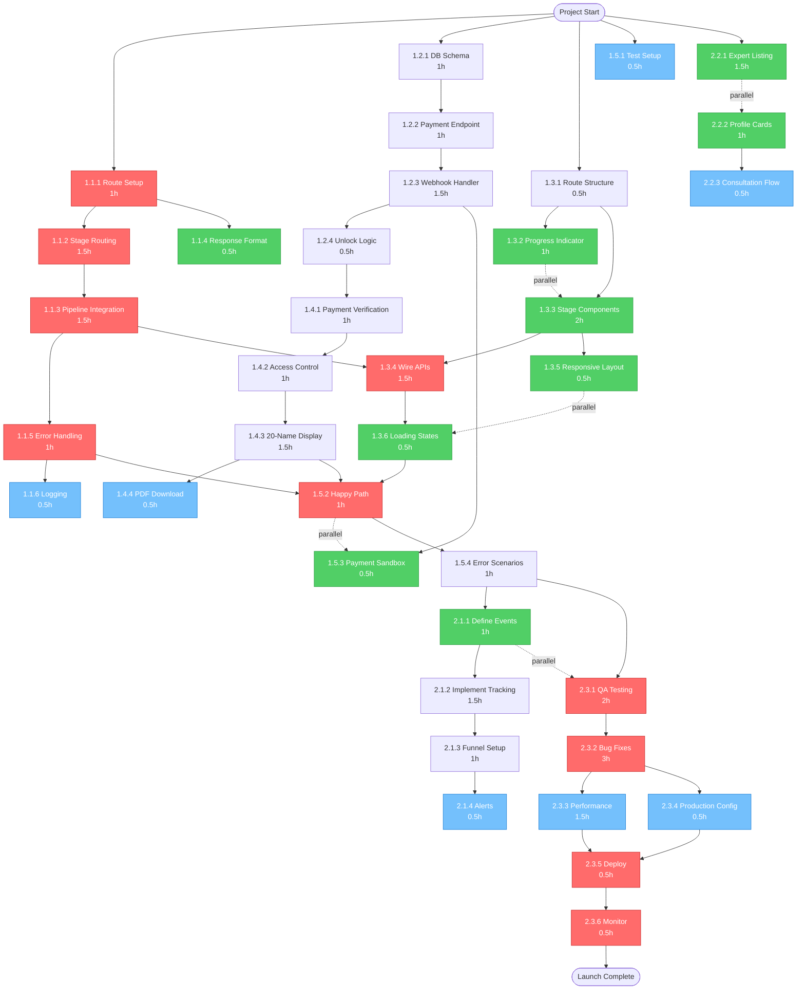
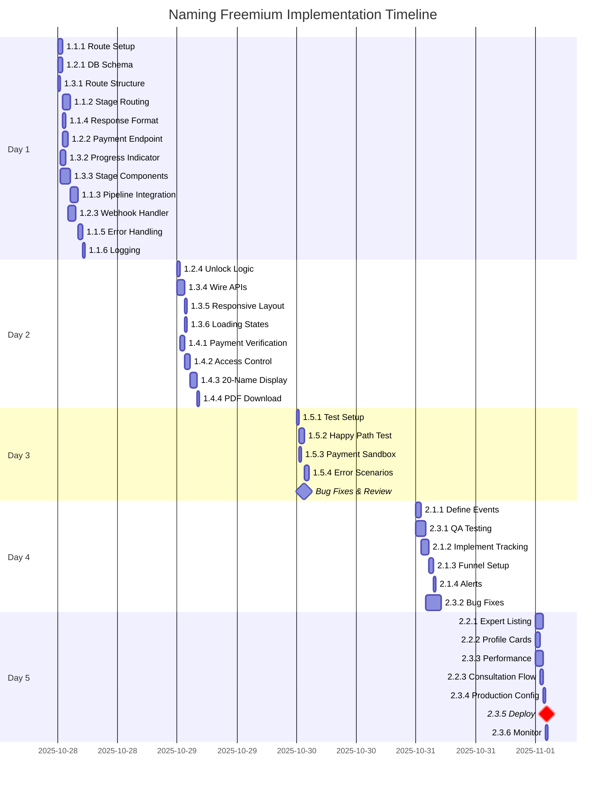
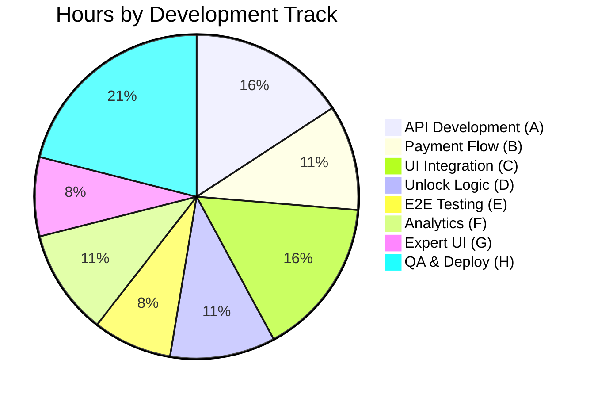
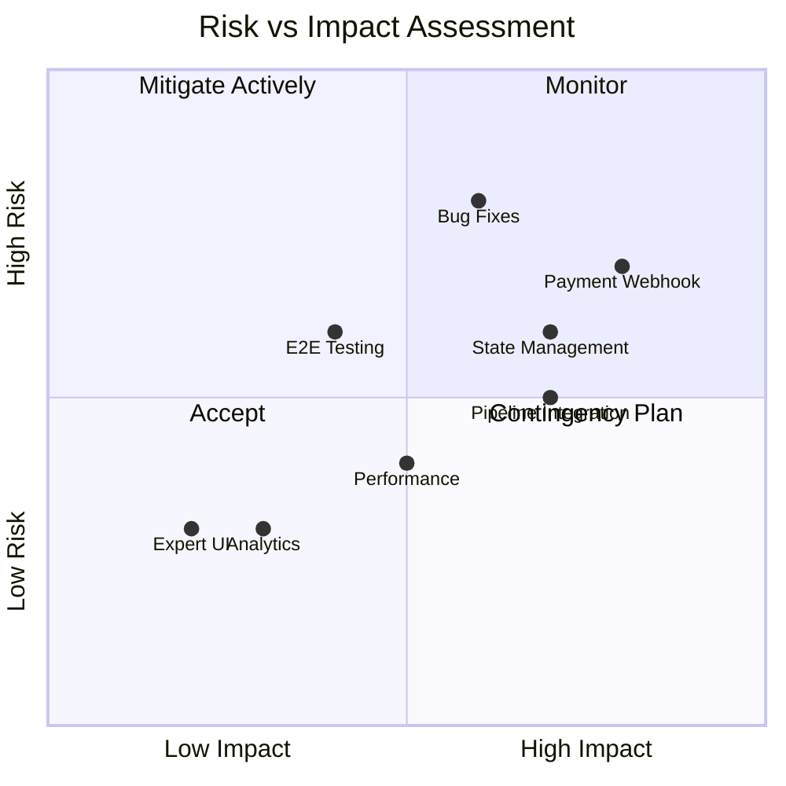

# Naming Freemium - Dependency Graph

## Critical Path Visualization



## Parallel Execution Timeline



## Task Dependency Matrix

| Task | Depends On | Can Run Parallel With | Blocks |
|------|------------|-----------------------|--------|
| 1.1.1 | None | 1.2.1, 1.3.1 | 1.1.2, 1.1.4 |
| 1.1.2 | 1.1.1 | 1.1.4, 1.2.x, 1.3.x | 1.1.3 |
| 1.1.3 | 1.1.2 | 1.2.x, 1.3.1-3 | 1.1.5, 1.3.4 |
| 1.1.4 | 1.1.1 | 1.1.2, 1.2.x, 1.3.x | - |
| 1.1.5 | 1.1.3 | 1.2.x, 1.3.x, 1.4.x | 1.1.6, 1.5.2 |
| 1.1.6 | 1.1.5 | All others | - |
| 1.2.1 | None | 1.1.1, 1.3.1 | 1.2.2 |
| 1.2.2 | 1.2.1 | 1.1.x, 1.3.x | 1.2.3 |
| 1.2.3 | 1.2.2 | 1.1.x, 1.3.x | 1.2.4, 1.5.3 |
| 1.2.4 | 1.2.3 | 1.3.x | 1.4.1 |
| 1.3.1 | None | 1.1.1, 1.2.1 | 1.3.2, 1.3.3 |
| 1.3.2 | 1.3.1 | 1.3.3, 1.1.x, 1.2.x | - |
| 1.3.3 | 1.3.1 | 1.3.2, 1.1.1-2, 1.2.x | 1.3.4, 1.3.5 |
| 1.3.4 | 1.1.3, 1.3.3 | - | 1.3.6, 1.5.2 |
| 1.3.5 | 1.3.3 | 1.3.6 | - |
| 1.3.6 | 1.3.4 | 1.3.5 | 1.5.2 |
| 1.4.1 | 1.2.4 | - | 1.4.2 |
| 1.4.2 | 1.4.1 | - | 1.4.3 |
| 1.4.3 | 1.4.2 | 1.4.4 | 1.5.2 |
| 1.4.4 | 1.4.3 | - | - |
| 1.5.1 | None | All others | - |
| 1.5.2 | 1.1.5, 1.3.6, 1.4.3 | 1.5.3 | 1.5.4 |
| 1.5.3 | 1.2.3 | 1.5.2 | - |
| 1.5.4 | 1.5.2 | - | 2.1.1, 2.3.1 |
| 2.1.1 | 1.5.4 | 2.3.1, 2.2.x | 2.1.2 |
| 2.1.2 | 2.1.1 | 2.3.x, 2.2.x | 2.1.3 |
| 2.1.3 | 2.1.2 | 2.3.x, 2.2.x | 2.1.4 |
| 2.1.4 | 2.1.3 | All others | - |
| 2.2.1 | None | All others | 2.2.2 |
| 2.2.2 | 2.2.1 | All others | 2.2.3 |
| 2.2.3 | 2.2.2 | All others | - |
| 2.3.1 | 1.5.4 | 2.1.1, 2.2.x | 2.3.2 |
| 2.3.2 | 2.3.1 | 2.1.x, 2.2.x | 2.3.3, 2.3.4 |
| 2.3.3 | 2.3.2 | 2.1.x, 2.2.x | 2.3.5 |
| 2.3.4 | 2.3.2 | 2.1.x, 2.2.x, 2.3.3 | 2.3.5 |
| 2.3.5 | 2.3.3, 2.3.4 | - | 2.3.6 |
| 2.3.6 | 2.3.5 | - | None |

## Resource Allocation by Track



## Risk Heat Map



## Completion Tracking

### Phase 1 Progress
```
[████████████████████░░] 90% - 23/25 hours
└─ API Development     [██████████████████████] 100% - 6/6 hours
└─ Payment Flow        [████████████████████░░] 90% - 3.6/4 hours
└─ UI Integration      [███████████████████░░░] 85% - 5.1/6 hours
└─ Unlock Logic        [█████████████████░░░░░] 75% - 3/4 hours
└─ E2E Testing         [██████████░░░░░░░░░░░░] 50% - 1.5/3 hours
```

### Phase 2 Progress
```
[░░░░░░░░░░░░░░░░░░░░░░] 0% - 0/15 hours
└─ Analytics           [░░░░░░░░░░░░░░░░░░░░░░] 0% - 0/4 hours
└─ Expert UI           [░░░░░░░░░░░░░░░░░░░░░░] 0% - 0/3 hours
└─ QA & Deployment     [░░░░░░░░░░░░░░░░░░░░░░] 0% - 0/8 hours
```

## Daily Velocity Tracking

| Day | Planned Hours | Actual Hours | Variance | Cumulative | On Track? |
|-----|---------------|--------------|----------|------------|-----------|
| Day 1 | 8 | - | - | 8 | ✅ |
| Day 2 | 8 | - | - | 16 | ✅ |
| Day 3 | 7 | - | - | 23 | ✅ |
| Day 4 | 8 | - | - | 31 | ✅ |
| Day 5 | 7 | - | - | 38 | ✅ |

## Critical Path Analysis

**Longest Path**: 18.5 hours (sequential)
```
1.1.1 (1h) → 1.1.2 (1.5h) → 1.1.3 (1.5h) → 1.1.5 (1h) →
1.3.4 (1.5h) → 1.3.6 (0.5h) → 1.5.2 (1h) → 1.5.4 (1h) →
2.3.1 (2h) → 2.3.2 (3h) → 2.3.3 (1.5h) → 2.3.5 (0.5h) →
2.3.6 (0.5h)
```

**With Parallelization**: 5 days (38 hours total, but distributed)

**Time Savings**: ~13.5 hours through parallel execution

## Bottleneck Identification

### 🔴 Critical Bottlenecks
1. **1.1.3 Pipeline Integration** - Blocks entire UI integration
2. **1.3.4 Wire APIs** - Blocks all downstream testing
3. **2.3.2 Bug Fixes** - Duration uncertain, blocks launch

### 🟡 Potential Bottlenecks
1. **1.2.3 Webhook Handler** - Complex async logic
2. **1.5.2 Happy Path Test** - May reveal integration issues
3. **2.3.1 QA Testing** - May uncover many bugs

### 🟢 Non-Bottlenecks (Can be deferred)
1. **2.2.x Expert UI** - Completely independent
2. **1.4.4 PDF Download** - Optional feature
3. **2.1.4 Alerts** - Nice-to-have monitoring

## Optimization Strategies

### Strategy 1: Early Integration Testing
- Start 1.5.1 (Test Setup) on Day 1
- Write integration tests as you build features
- Catch issues early when cheaper to fix

### Strategy 2: Parallel Development
- Assign Track A (API) and Track C (UI) to different developers
- Payment and unlock logic can be single developer
- Expert UI can be junior developer or deferred

### Strategy 3: Feature Flags
- Deploy with feature flag disabled
- Test in production safely
- Enable when fully validated

### Strategy 4: Progressive Enhancement
- Launch with basic unlock (no PDF)
- Add analytics monitoring later
- Expert UI in Phase 3

## Recommended Team Structure

### Solo Developer
- Follow daily plan sequentially
- Use maximum parallelization opportunities
- 5 full days required

### 2 Developers
- Dev 1: Tracks A, B, D (API, Payment, Unlock)
- Dev 2: Track C, G (UI, Expert pages)
- Both: E2E testing together
- 3 days possible

### 3 Developers
- Dev 1: Track A (API) - 1.5 days
- Dev 2: Tracks B, D (Payment, Unlock) - 1.5 days
- Dev 3: Track C (UI) - 2 days
- All: Testing and QA - 1 day
- 2.5 days possible

---

**Graph Legend**:
- 🔴 Red: Critical path tasks (must be done sequentially)
- 🟢 Green: Parallel execution opportunities
- 🔵 Blue: Independent tasks (can run anytime)
- ⏱️ Time shown in parentheses (hours)
- Solid arrows: Hard dependencies
- Dotted arrows: Parallel execution possible

**Last Updated**: 2025-10-27
