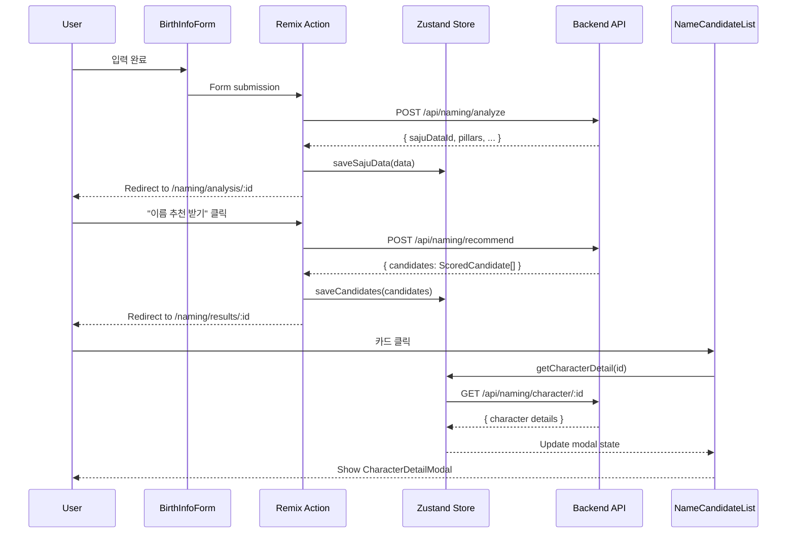
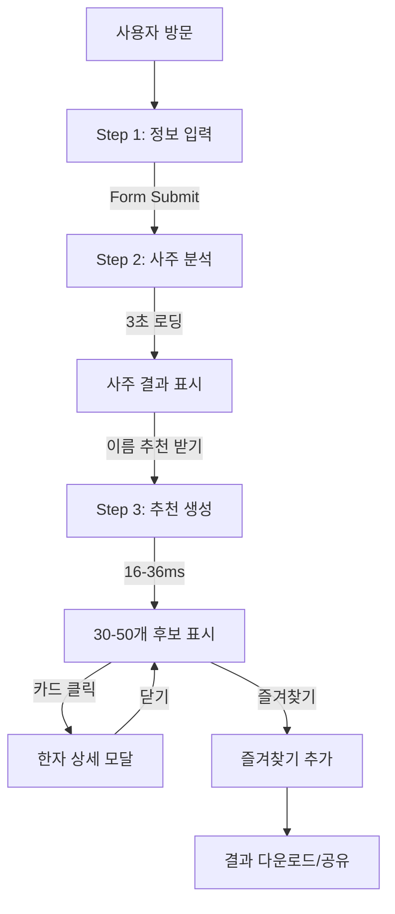
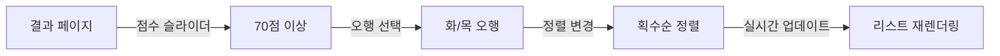

# Phase 3: 작명 서비스 UI 컴포넌트 아키텍처

**날짜**: 2025-10-15
**상태**: Phase 3 설계 문서 (Phase 1 & 2 완료 후)
**작성자**: System Architect

---

## 목차

1. [개요](#1-개요)
2. [컴포넌트 아키텍처](#2-컴포넌트-아키텍처)
3. [라우팅 구조](#3-라우팅-구조)
4. [상태 관리 전략](#4-상태-관리-전략)
5. [UI/UX 플로우](#5-uiux-플로우)
6. [데이터 페칭 전략](#6-데이터-페칭-전략)
7. [스타일링 전략](#7-스타일링-전략)
8. [성능 최적화](#8-성능-최적화)
9. [구현 우선순위](#9-구현-우선순위)

---

## 1. 개요

### 1.1 프로젝트 컨텍스트

**기술 스택**:
- Framework: Remix v2.16.8
- UI: Shadcn/UI (Radix UI primitives)
- Styling: Tailwind CSS v3.4.17
- State: Zustand v5.0.6
- Animation: Framer Motion v12.23.6
- Charts: Chart.js v4.5.0 + react-chartjs-2 v5.3.0

**완료된 Phase 1 & 2**:
- ✅ Phase 1: 사주 계산 알고리즘 (8-60ms)
- ✅ Phase 2: REST API 3개 엔드포인트
  - `POST /api/naming/analyze` (사주 분석)
  - `POST /api/naming/recommend` (이름 추천, 30-50개, 16-36ms)
  - `GET /api/naming/character/:id` (한자 상세)

**Phase 3 목표**:
- 🎨 사용자 친화적 작명 입력 폼
- 📊 사주 분석 결과 시각화
- 📋 30-50개 이름 추천 리스트 (정렬/필터링)
- 🔍 한자 상세 정보 모달
- 📱 모바일 우선 반응형 디자인

### 1.2 핵심 설계 원칙

**Architecture Principles**:
1. **Component Composition**: 작고 재사용 가능한 컴포넌트로 구성
2. **Single Responsibility**: 각 컴포넌트는 하나의 명확한 책임
3. **Data Flow Control**: Remix loader/action → Zustand → Component
4. **Performance First**: 가상화, 메모이제이션, 코드 스플리팅
5. **Mobile First**: 작명 서비스는 모바일 사용자가 70%+

**Design System Integration**:
- Shadcn/UI components as base
- Tailwind utility-first approach
- Consistent spacing/color tokens
- Accessible by default (WCAG 2.1 AA)

---

## 2. 컴포넌트 아키텍처

### 2.1 컴포넌트 계층 구조

```mermaid
graph TD
    A[/naming Route] --> B[NamingLayout]
    B --> C[InputStep]
    B --> D[AnalysisStep]
    B --> E[ResultsStep]
    B --> F[DetailStep]

    C --> C1[BirthInfoForm]
    C --> C2[PreferencesForm]
    C1 --> C1a[DateTimePicker]
    C1 --> C1b[CalendarTypeToggle]
    C1 --> C1c[GenderSelect]
    C2 --> C2a[ElementSelector]
    C2 --> C2b[HanjaPreferenceInput]

    D --> D1[SajuAnalysisCard]
    D --> D2[ElementDistributionChart]
    D --> D3[PillarDisplay]
    D1 --> D1a[ElementBadge]
    D2 --> D2a[RadarChart]

    E --> E1[NameCandidateList]
    E --> E2[FilterBar]
    E --> E3[SortControls]
    E1 --> E1a[NameCard]
    E1a --> E1b[ScoreBreakdown]
    E1a --> E1c[HanjaInfo]
    E1a --> E1d[FavoriteButton]

    F --> F1[CharacterDetailModal]
    F1 --> F1a[CharacterDisplay]
    F1 --> F1b[ScoreDetailChart]
    F1 --> F1c[AlternativeReadings]
```

### 2.2 페이지별 컴포넌트 구조

#### **Step 1: 입력 페이지 (`/naming`)**

```tsx
// app/routes/naming._index.tsx
export default function NamingInputPage() {
  return (
    <NamingLayout step="input">
      <StepIndicator currentStep={1} />
      <BirthInfoForm onSubmit={handleBirthSubmit} />
      <PreferencesForm optional />
    </NamingLayout>
  );
}
```

**컴포넌트 분해**:
```
NamingLayout (shell)
├── StepIndicator (progress)
├── BirthInfoForm (main input)
│   ├── DateTimePicker (birthDate, birthTime)
│   ├── CalendarTypeToggle (양력/음력)
│   ├── GenderSelect (성별)
│   └── LastNameInput (성씨)
└── PreferencesForm (optional)
    ├── ElementSelector (선호 오행)
    └── HanjaPreferenceInput (선호 한자)
```

#### **Step 2: 사주 분석 페이지 (`/naming/analysis/:id`)**

```tsx
// app/routes/naming.analysis.$id.tsx
export default function AnalysisPage() {
  const { sajuData } = useLoaderData<typeof loader>();

  return (
    <NamingLayout step="analysis">
      <StepIndicator currentStep={2} />
      <SajuAnalysisCard data={sajuData} />
      <ElementDistributionChart elements={sajuData.elementCounts} />
      <PillarDisplay pillars={sajuData.pillars} />
      <ActionButton onClick={navigateToResults}>
        이름 추천 받기
      </ActionButton>
    </NamingLayout>
  );
}
```

**컴포넌트 분해**:
```
NamingLayout
├── StepIndicator
├── SajuAnalysisCard (summary)
│   ├── ElementBadge × 5 (오행 표시)
│   └── LackingElementsAlert
├── ElementDistributionChart (Chart.js radar)
├── PillarDisplay (사주팔자 grid)
│   └── PillarColumn × 4 (년월일시)
└── ActionButton
```

#### **Step 3: 추천 결과 페이지 (`/naming/results/:id`)**

```tsx
// app/routes/naming.results.$id.tsx
export default function ResultsPage() {
  const { candidates, saju } = useLoaderData<typeof loader>();

  return (
    <NamingLayout step="results">
      <StepIndicator currentStep={3} />
      <FilterBar onFilterChange={handleFilter} />
      <SortControls onSortChange={handleSort} />
      <NameCandidateList
        candidates={candidates}
        onCardClick={handleCardClick}
        onFavorite={handleFavorite}
      />
      <Pagination total={candidates.length} />
    </NamingLayout>
  );
}
```

**컴포넌트 분해**:
```
NamingLayout
├── StepIndicator
├── FilterBar
│   ├── ScoreRangeSlider (점수 필터)
│   ├── ElementFilter (오행 필터)
│   └── GenderFilter
├── SortControls
│   └── SortDropdown (점수순/획수순/의미순)
├── NameCandidateList (virtualized)
│   └── NameCard × 30-50
│       ├── NameDisplay (한글 + 한자)
│       ├── ScoreBreakdown (4개 점수)
│       ├── HanjaInfo (간단 정보)
│       └── FavoriteButton
└── Pagination
```

#### **Step 4: 한자 상세 모달**

```tsx
// app/components/naming/CharacterDetailModal.tsx
export function CharacterDetailModal({ characterId, open, onClose }) {
  const character = useCharacterDetail(characterId);

  return (
    <Dialog open={open} onOpenChange={onClose}>
      <DialogContent className="max-w-2xl">
        <CharacterDisplay character={character.character} />
        <ScoreDetailChart scores={character.scores} />
        <ElementBadge element={character.element} />
        <AlternativeReadings readings={character.readings} />
        <MeaningSection meaning={character.meaning} />
      </DialogContent>
    </Dialog>
  );
}
```

### 2.3 재사용 가능한 공통 컴포넌트

#### **Core UI Components** (in `app/components/ui/`)

1. **FormComponents**:
```tsx
// app/components/ui/date-time-picker.tsx
export function DateTimePicker({
  value,
  onChange,
  calendarType
}: DateTimePickerProps) {
  return (
    <div className="space-y-2">
      <Popover>
        <PopoverTrigger asChild>
          <Button variant="outline">
            <CalendarIcon />
            {format(value, "yyyy년 MM월 dd일")}
          </Button>
        </PopoverTrigger>
        <PopoverContent>
          <Calendar
            mode="single"
            selected={value}
            onSelect={onChange}
            locale={ko}
          />
        </PopoverContent>
      </Popover>
      <Input
        type="time"
        value={formatTime(value)}
        onChange={handleTimeChange}
      />
    </div>
  );
}
```

2. **DataDisplay Components**:
```tsx
// app/components/ui/element-badge.tsx
export function ElementBadge({ element, count }: ElementBadgeProps) {
  const colors = {
    WOOD: 'bg-green-100 text-green-800',
    FIRE: 'bg-red-100 text-red-800',
    EARTH: 'bg-yellow-100 text-yellow-800',
    METAL: 'bg-gray-100 text-gray-800',
    WATER: 'bg-blue-100 text-blue-800',
  };

  return (
    <Badge className={cn(colors[element])}>
      {ELEMENT_LABELS[element]} {count && `(${count})`}
    </Badge>
  );
}
```

3. **Chart Components**:
```tsx
// app/components/ui/element-chart.tsx
import { Radar } from 'react-chartjs-2';

export function ElementRadarChart({ elementCounts }: ElementChartProps) {
  const data = {
    labels: ['목', '화', '토', '금', '수'],
    datasets: [{
      label: '오행 분포',
      data: Object.values(elementCounts),
      backgroundColor: 'rgba(251, 146, 60, 0.2)',
      borderColor: 'rgba(251, 146, 60, 1)',
      borderWidth: 2,
    }],
  };

  return (
    <div className="w-full h-64">
      <Radar data={data} options={radarOptions} />
    </div>
  );
}
```

#### **Domain Components** (in `app/components/naming/`)

1. **NameCard**:
```tsx
// app/components/naming/name-card.tsx
export function NameCard({
  candidate,
  onClick,
  onFavorite
}: NameCardProps) {
  return (
    <Card
      className="hover:shadow-lg transition-shadow cursor-pointer"
      onClick={onClick}
    >
      <CardHeader>
        <div className="flex justify-between items-start">
          <div>
            <CardTitle className="text-2xl">
              {candidate.firstName.join('')}
            </CardTitle>
            <CardDescription className="text-lg">
              {candidate.characters.map(c => c.character).join('')}
            </CardDescription>
          </div>
          <div className="flex items-center gap-2">
            <ScoreBadge score={candidate.scores.overall} />
            <Button
              variant="ghost"
              size="icon"
              onClick={(e) => {
                e.stopPropagation();
                onFavorite(candidate);
              }}
            >
              <Heart />
            </Button>
          </div>
        </div>
      </CardHeader>
      <CardContent>
        <div className="grid grid-cols-2 gap-2 text-sm">
          <ScoreItem
            label="오행조화"
            score={candidate.scores.elementHarmony.score}
          />
          <ScoreItem
            label="음양균형"
            score={candidate.scores.yinYangBalance.score}
          />
          <ScoreItem
            label="수리길흉"
            score={candidate.scores.numerology.score}
          />
          <ScoreItem
            label="의미조화"
            score={candidate.scores.meaningHarmony.score}
          />
        </div>
        <div className="mt-3 flex gap-1">
          {candidate.characters.map((char, i) => (
            <ElementBadge
              key={i}
              element={char.element}
            />
          ))}
        </div>
      </CardContent>
    </Card>
  );
}
```

2. **SajuPillarDisplay**:
```tsx
// app/components/naming/pillar-display.tsx
export function PillarDisplay({ pillars }: PillarDisplayProps) {
  return (
    <div className="grid grid-cols-4 gap-4 p-4 bg-gradient-to-br from-orange-50 to-white rounded-lg">
      {(['year', 'month', 'day', 'hour'] as const).map((type) => (
        <div key={type} className="text-center space-y-2">
          <div className="text-xs text-gray-500 font-medium">
            {PILLAR_LABELS[type]}
          </div>
          <div className="space-y-1">
            <div className="text-2xl font-bold text-gray-900">
              {pillars[type].stem}
            </div>
            <div className="text-xl font-semibold text-gray-700">
              {pillars[type].branch}
            </div>
          </div>
          <div className="text-xs text-gray-600">
            {getStemElement(pillars[type].stem)}
          </div>
        </div>
      ))}
    </div>
  );
}
```

### 2.4 컴포넌트 데이터 흐름



---

## 3. 라우팅 구조

### 3.1 Remix 파일 기반 라우팅

```
app/routes/
├── naming._index.tsx              # Step 1: 입력 폼
├── naming.analysis.$id.tsx        # Step 2: 사주 분석
├── naming.results.$id.tsx         # Step 3: 추천 결과
├── naming.favorites.tsx           # 즐겨찾기 목록
├── naming.history.tsx             # 이전 분석 내역
├── api.naming.analyze.ts          # ✅ Phase 2 완료
├── api.naming.recommend.ts        # ✅ Phase 2 완료
└── api.naming.character.$id.ts    # ✅ Phase 2 완료
```

### 3.2 중첩 라우팅 활용

```tsx
// app/routes/naming.tsx (Layout Route)
export default function NamingLayout() {
  return (
    <div className="min-h-screen bg-gradient-to-b from-orange-50 to-white">
      <NamingHeader />
      <main className="container mx-auto px-4 py-8">
        <Outlet />
      </main>
      <NamingFooter />
    </div>
  );
}
```

**Layout 이점**:
- 공통 헤더/푸터 재사용
- 공통 스타일 적용
- 페이지 전환 시 레이아웃 유지
- 공통 로딩/에러 처리

### 3.3 라우트별 Loader/Action

#### **Step 1: Input** (`naming._index.tsx`)
```tsx
export async function action({ request }: ActionFunctionArgs) {
  const formData = await request.formData();
  const birthData = {
    birthDate: formData.get('birthDate'),
    birthTime: formData.get('birthTime'),
    isLunar: formData.get('calendarType') === 'lunar',
    gender: formData.get('gender'),
  };

  // Call Phase 2 API
  const response = await fetch('/api/naming/analyze', {
    method: 'POST',
    headers: { 'Content-Type': 'application/json' },
    body: JSON.stringify(birthData),
  });

  const result = await response.json();

  if (!result.success) {
    return json({ error: result.error }, { status: 400 });
  }

  // Redirect to analysis page
  return redirect(`/naming/analysis/${result.data.sajuDataId}`);
}
```

#### **Step 2: Analysis** (`naming.analysis.$id.tsx`)
```tsx
export async function loader({ params }: LoaderFunctionArgs) {
  const { id } = params;

  // Fetch from database (Phase 2 saved this)
  const sajuData = await prisma.sajuData.findUnique({
    where: { id },
  });

  if (!sajuData) {
    throw new Response('Not Found', { status: 404 });
  }

  return json({ sajuData });
}

export async function action({ request, params }: ActionFunctionArgs) {
  const { id } = params;
  const formData = await request.formData();
  const lastName = formData.get('lastName');

  // Call Phase 2 recommend API
  const response = await fetch('/api/naming/recommend', {
    method: 'POST',
    headers: { 'Content-Type': 'application/json' },
    body: JSON.stringify({
      sajuDataId: id,
      lastName,
      preferences: {
        minScore: 65,
        maxResults: 50,
      },
    }),
  });

  const result = await response.json();

  return redirect(`/naming/results/${id}`);
}
```

#### **Step 3: Results** (`naming.results.$id.tsx`)
```tsx
export async function loader({ params, request }: LoaderFunctionArgs) {
  const { id } = params;
  const url = new URL(request.url);

  // Get filter/sort params
  const minScore = url.searchParams.get('minScore') || '60';
  const sortBy = url.searchParams.get('sortBy') || 'score';

  // Fetch candidates from cache or regenerate
  const candidates = await getCandidatesForSaju(id, {
    minScore: Number(minScore),
    sortBy,
  });

  const sajuData = await prisma.sajuData.findUnique({
    where: { id },
  });

  return json({
    candidates,
    saju: sajuData,
    filters: { minScore, sortBy }
  });
}
```

### 3.4 에러 바운더리

```tsx
// app/routes/naming.tsx (Layout)
export function ErrorBoundary() {
  const error = useRouteError();

  if (isRouteErrorResponse(error)) {
    return (
      <div className="container mx-auto px-4 py-16 text-center">
        <h1 className="text-4xl font-bold text-red-600">
          {error.status} {error.statusText}
        </h1>
        <p className="mt-4 text-gray-600">{error.data}</p>
        <Button asChild className="mt-8">
          <Link to="/naming">처음으로 돌아가기</Link>
        </Button>
      </div>
    );
  }

  return (
    <div className="container mx-auto px-4 py-16 text-center">
      <h1 className="text-4xl font-bold text-red-600">
        오류가 발생했습니다
      </h1>
      <p className="mt-4 text-gray-600">
        잠시 후 다시 시도해주세요.
      </p>
    </div>
  );
}
```

---

## 4. 상태 관리 전략

### 4.1 Zustand Store 설계

**핵심 원칙**:
- Remix는 서버 상태 관리 (loader/action)
- Zustand는 클라이언트 UI 상태만 관리
- 최소한의 상태만 저장

#### **NamingStore** (`app/store/naming.store.ts`)

```typescript
import { create } from 'zustand';
import { persist } from 'zustand/middleware';
import type { ScoredCandidate, SajuResult } from '~/lib/naming/types';

interface NamingState {
  // Current session data
  currentSajuId: string | null;
  favorites: string[]; // candidate IDs

  // UI state
  filters: {
    minScore: number;
    maxScore: number;
    elements: Element[];
    gender?: 'male' | 'female';
  };
  sortBy: 'score' | 'strokes' | 'meaning';

  // Modal state
  selectedCharacterId: string | null;

  // Actions
  setCurrentSaju: (id: string) => void;
  toggleFavorite: (candidateId: string) => void;
  updateFilters: (filters: Partial<NamingState['filters']>) => void;
  setSortBy: (sortBy: NamingState['sortBy']) => void;
  openCharacterDetail: (id: string) => void;
  closeCharacterDetail: () => void;
  clearSession: () => void;
}

export const useNamingStore = create<NamingState>()(
  persist(
    (set) => ({
      // Initial state
      currentSajuId: null,
      favorites: [],
      filters: {
        minScore: 60,
        maxScore: 100,
        elements: [],
      },
      sortBy: 'score',
      selectedCharacterId: null,

      // Actions
      setCurrentSaju: (id) => set({ currentSajuId: id }),

      toggleFavorite: (candidateId) => set((state) => ({
        favorites: state.favorites.includes(candidateId)
          ? state.favorites.filter((id) => id !== candidateId)
          : [...state.favorites, candidateId],
      })),

      updateFilters: (filters) => set((state) => ({
        filters: { ...state.filters, ...filters },
      })),

      setSortBy: (sortBy) => set({ sortBy }),

      openCharacterDetail: (id) => set({ selectedCharacterId: id }),

      closeCharacterDetail: () => set({ selectedCharacterId: null }),

      clearSession: () => set({
        currentSajuId: null,
        favorites: [],
        filters: { minScore: 60, maxScore: 100, elements: [] },
        sortBy: 'score',
        selectedCharacterId: null,
      }),
    }),
    {
      name: 'naming-storage',
      // Only persist favorites and currentSajuId
      partialize: (state) => ({
        currentSajuId: state.currentSajuId,
        favorites: state.favorites,
      }),
    }
  )
);
```

#### **Usage in Components**

```tsx
// In ResultsPage
function ResultsPage() {
  const { data } = useLoaderData<typeof loader>();
  const {
    favorites,
    toggleFavorite,
    filters,
    updateFilters,
    openCharacterDetail
  } = useNamingStore();

  const filteredCandidates = useMemo(() => {
    return data.candidates.filter((c) =>
      c.scores.overall >= filters.minScore &&
      c.scores.overall <= filters.maxScore
    );
  }, [data.candidates, filters]);

  return (
    <div>
      <FilterBar
        filters={filters}
        onFilterChange={updateFilters}
      />
      <NameCandidateList
        candidates={filteredCandidates}
        favorites={favorites}
        onFavorite={toggleFavorite}
        onCharacterClick={openCharacterDetail}
      />
    </div>
  );
}
```

### 4.2 서버 상태 vs 클라이언트 상태

**서버 상태 (Remix loader/action)**:
- ✅ 사주 분석 결과 (sajuData)
- ✅ 이름 추천 후보 (candidates)
- ✅ 한자 상세 정보 (characterDetail)
- ✅ 사용자 이력 (history)

**클라이언트 상태 (Zustand)**:
- ✅ 필터/정렬 설정 (filters, sortBy)
- ✅ 즐겨찾기 목록 (favorites)
- ✅ 모달 상태 (selectedCharacterId)
- ✅ 현재 세션 ID (currentSajuId)

**Why This Split?**:
- 서버 상태는 Single Source of Truth
- 클라이언트 상태는 UI 인터랙션만
- Hydration 문제 최소화
- SSR 호환성 유지

---

## 5. UI/UX 플로우

### 5.1 사용자 시나리오

#### **시나리오 1: 신생아 작명 (전체 플로우)**



**타이밍**:
- Step 1 → 2: Form validation (즉시)
- Step 2 로딩: 3초 (animation)
- Step 2 → 3: 성씨 입력 후 submit
- Step 3 로딩: 16-36ms (Phase 2 실측)
- 모달 open: 200ms (fetch character detail)

#### **시나리오 2: 빠른 필터링**



**성능 목표**:
- 필터 적용: < 100ms (클라이언트 측 필터링)
- 정렬 변경: < 50ms (메모이제이션)
- 리스트 렌더링: < 200ms (가상화)

### 5.2 로딩 상태 처리

#### **Skeleton Screens**

```tsx
// app/components/naming/skeleton.tsx
export function NameCardSkeleton() {
  return (
    <Card>
      <CardHeader>
        <Skeleton className="h-8 w-32" />
        <Skeleton className="h-6 w-24 mt-2" />
      </CardHeader>
      <CardContent>
        <div className="grid grid-cols-2 gap-2">
          <Skeleton className="h-4 w-full" />
          <Skeleton className="h-4 w-full" />
          <Skeleton className="h-4 w-full" />
          <Skeleton className="h-4 w-full" />
        </div>
      </CardContent>
    </Card>
  );
}

export function ResultsPageSkeleton() {
  return (
    <div>
      <Skeleton className="h-12 w-full mb-4" /> {/* FilterBar */}
      <div className="space-y-4">
        {Array.from({ length: 10 }).map((_, i) => (
          <NameCardSkeleton key={i} />
        ))}
      </div>
    </div>
  );
}
```

#### **Suspense with Defer** (for Step 3)

```tsx
// app/routes/naming.results.$id.tsx
export async function loader({ params }: LoaderFunctionArgs) {
  const { id } = params;

  // Fast: Load saju data immediately
  const sajuData = await prisma.sajuData.findUnique({
    where: { id }
  });

  // Slow: Defer candidates loading
  const candidatesPromise = getCandidatesForSaju(id);

  return defer({
    sajuData,
    candidates: candidatesPromise,
  });
}

export default function ResultsPage() {
  const { sajuData, candidates } = useLoaderData<typeof loader>();

  return (
    <div>
      {/* Show immediately */}
      <SajuSummary data={sajuData} />

      {/* Suspense boundary */}
      <Suspense fallback={<ResultsPageSkeleton />}>
        <Await resolve={candidates}>
          {(resolvedCandidates) => (
            <NameCandidateList candidates={resolvedCandidates} />
          )}
        </Await>
      </Suspense>
    </div>
  );
}
```

### 5.3 에러 상태 처리

#### **Toast Notifications** (Sonner)

```tsx
// app/components/naming/results-page.tsx
import { toast } from 'sonner';

function ResultsPage() {
  const handleFavorite = async (candidateId: string) => {
    try {
      toggleFavorite(candidateId);
      toast.success('즐겨찾기에 추가했습니다');
    } catch (error) {
      toast.error('즐겨찾기 추가 실패', {
        description: '다시 시도해주세요',
      });
    }
  };

  return (
    <>
      <NameCandidateList onFavorite={handleFavorite} />
      <Toaster position="top-center" />
    </>
  );
}
```

#### **Inline Error Messages**

```tsx
// app/components/naming/birth-info-form.tsx
export function BirthInfoForm() {
  const [errors, setErrors] = useState<Record<string, string>>({});

  const validate = (data: FormData) => {
    const newErrors: Record<string, string> = {};

    if (!data.get('birthDate')) {
      newErrors.birthDate = '생년월일을 입력해주세요';
    }

    if (!data.get('birthTime')) {
      newErrors.birthTime = '출생시간을 입력해주세요';
    }

    setErrors(newErrors);
    return Object.keys(newErrors).length === 0;
  };

  return (
    <form>
      <div>
        <Label htmlFor="birthDate">생년월일</Label>
        <DateTimePicker name="birthDate" />
        {errors.birthDate && (
          <p className="text-sm text-red-600 mt-1">
            {errors.birthDate}
          </p>
        )}
      </div>
    </form>
  );
}
```

### 5.4 애니메이션 타이밍

#### **Framer Motion Variants**

```tsx
// app/components/naming/animations.ts
export const containerVariants = {
  hidden: { opacity: 0 },
  show: {
    opacity: 1,
    transition: {
      staggerChildren: 0.1,
    },
  },
};

export const itemVariants = {
  hidden: { opacity: 0, y: 20 },
  show: { opacity: 1, y: 0 },
};

// Usage in NameCandidateList
export function NameCandidateList({ candidates }: Props) {
  return (
    <motion.div
      variants={containerVariants}
      initial="hidden"
      animate="show"
      className="space-y-4"
    >
      {candidates.map((candidate) => (
        <motion.div key={candidate.id} variants={itemVariants}>
          <NameCard candidate={candidate} />
        </motion.div>
      ))}
    </motion.div>
  );
}
```

**Animation Timing**:
- Stagger delay: 100ms (smooth cascade)
- Individual card: 300ms ease-out
- Modal enter: 200ms
- Modal exit: 150ms (faster exit)
- Hover scale: 100ms (responsive feel)

---

## 6. 데이터 페칭 전략

### 6.1 API 호출 시점

#### **Server-side (Remix loader)**
- ✅ Initial page load (SSR)
- ✅ Navigation between steps
- ✅ History/favorites list

#### **Client-side (fetch/useFetcher)**
- ✅ Filter/sort changes (query params)
- ✅ Character detail modal
- ✅ Favorite toggle (optimistic UI)

### 6.2 캐싱 전략

#### **Browser Cache (HTTP Headers)**

```tsx
// app/routes/api.naming.character.$id.ts
export async function loader({ params }: LoaderFunctionArgs) {
  const character = await getCharacterDetail(params.id);

  return json(character, {
    headers: {
      'Cache-Control': 'public, max-age=3600', // 1 hour
      'CDN-Cache-Control': 'max-age=86400', // 24 hours on CDN
    },
  });
}
```

#### **In-Memory Cache (LRU)**

```typescript
// app/lib/cache.server.ts
import { LRUCache } from 'lru-cache';

const candidatesCache = new LRUCache<string, ScoredCandidate[]>({
  max: 100, // 100 saju sessions
  ttl: 1000 * 60 * 30, // 30 minutes
});

export async function getCandidatesForSaju(
  sajuId: string,
  options: MatchingOptions
): Promise<ScoredCandidate[]> {
  const cacheKey = `${sajuId}-${JSON.stringify(options)}`;

  // Check cache first
  const cached = candidatesCache.get(cacheKey);
  if (cached) {
    console.log('[Cache Hit] Candidates for', sajuId);
    return cached;
  }

  // Generate new candidates
  const candidates = await generateCandidates(sajuId, options);

  // Cache for next time
  candidatesCache.set(cacheKey, candidates);

  return candidates;
}
```

### 6.3 낙관적 업데이트

#### **Favorite Toggle**

```tsx
// app/components/naming/name-card.tsx
import { useFetcher } from '@remix-run/react';

export function NameCard({ candidate }: NameCardProps) {
  const fetcher = useFetcher();
  const { favorites, toggleFavorite } = useNamingStore();

  const isFavorite = favorites.includes(candidate.id);

  // Optimistic UI
  const isOptimisticFavorite =
    fetcher.formData?.get('candidateId') === candidate.id
      ? fetcher.formData.get('action') === 'add'
      : isFavorite;

  const handleFavoriteClick = () => {
    // 1. Update local state immediately (optimistic)
    toggleFavorite(candidate.id);

    // 2. Send to server in background
    fetcher.submit(
      { candidateId: candidate.id, action: isFavorite ? 'remove' : 'add' },
      { method: 'POST', action: '/api/naming/favorite' }
    );
  };

  return (
    <Card>
      <Button onClick={handleFavoriteClick}>
        <Heart fill={isOptimisticFavorite ? 'red' : 'none'} />
      </Button>
    </Card>
  );
}
```

### 6.4 에러 복구

#### **Retry Logic**

```typescript
// app/lib/api-client.ts
export async function fetchWithRetry<T>(
  url: string,
  options: RequestInit,
  maxRetries = 3
): Promise<T> {
  let lastError: Error;

  for (let i = 0; i < maxRetries; i++) {
    try {
      const response = await fetch(url, options);

      if (!response.ok) {
        throw new Error(`HTTP ${response.status}`);
      }

      return await response.json();
    } catch (error) {
      lastError = error as Error;

      // Exponential backoff
      if (i < maxRetries - 1) {
        await new Promise(resolve =>
          setTimeout(resolve, Math.pow(2, i) * 1000)
        );
      }
    }
  }

  throw lastError!;
}
```

---

## 7. 스타일링 전략

### 7.1 Tailwind 유틸리티 패턴

#### **Color Palette** (tailwind.config.js)

```javascript
module.exports = {
  theme: {
    extend: {
      colors: {
        primary: {
          50: '#fff7ed',
          100: '#ffedd5',
          500: '#f97316', // Orange
          600: '#ea580c',
          700: '#c2410c',
        },
        element: {
          wood: '#22c55e',
          fire: '#ef4444',
          earth: '#fbbf24',
          metal: '#9ca3af',
          water: '#3b82f6',
        },
      },
    },
  },
};
```

#### **Spacing System**

```tsx
// Consistent spacing tokens
const spacing = {
  section: 'space-y-8',     // Between sections
  card: 'space-y-4',        // Within cards
  inline: 'gap-2',          // Inline elements
  grid: 'gap-4',            // Grid items
};

// Usage
<div className="space-y-8">
  <section className="space-y-4">
    <h2>Section Title</h2>
    <div className="grid grid-cols-2 gap-4">
      <Card />
      <Card />
    </div>
  </section>
</div>
```

### 7.2 Shadcn/UI 커스터마이징

#### **Card Variants**

```tsx
// app/components/ui/card.tsx (extend Shadcn)
import { cva, type VariantProps } from 'class-variance-authority';

const cardVariants = cva(
  'rounded-lg border bg-card text-card-foreground shadow-sm',
  {
    variants: {
      variant: {
        default: 'border-gray-200',
        highlighted: 'border-primary-500 shadow-primary-100',
        error: 'border-red-500 bg-red-50',
      },
      size: {
        default: 'p-6',
        sm: 'p-4',
        lg: 'p-8',
      },
    },
    defaultVariants: {
      variant: 'default',
      size: 'default',
    },
  }
);

export interface CardProps
  extends React.HTMLAttributes<HTMLDivElement>,
    VariantProps<typeof cardVariants> {}

export function Card({ variant, size, className, ...props }: CardProps) {
  return (
    <div
      className={cn(cardVariants({ variant, size }), className)}
      {...props}
    />
  );
}
```

#### **Button Variants for Naming**

```tsx
// app/components/ui/button.tsx (extend)
const buttonVariants = cva(
  'inline-flex items-center justify-center rounded-md...',
  {
    variants: {
      variant: {
        // ... existing variants
        favorite: 'text-red-500 hover:bg-red-50',
        score: 'bg-gradient-to-r from-primary-500 to-primary-600',
      },
    },
  }
);
```

### 7.3 반응형 브레이크포인트

#### **Mobile-First Approach**

```tsx
// Base (mobile): < 640px
<div className="grid grid-cols-1 gap-4">

// Tablet: 640px - 1024px
<div className="grid grid-cols-1 sm:grid-cols-2 md:grid-cols-3 gap-4">

// Desktop: > 1024px
<div className="grid grid-cols-1 sm:grid-cols-2 md:grid-cols-3 lg:grid-cols-4 gap-4">
```

#### **Responsive Component Example**

```tsx
export function NameCard({ candidate }: NameCardProps) {
  return (
    <Card className="
      /* Mobile: full width, compact */
      w-full p-4

      /* Tablet: 2 columns, more padding */
      sm:p-6

      /* Desktop: 3 columns, hover effects */
      lg:hover:shadow-xl lg:transition-shadow
    ">
      <CardHeader className="
        /* Mobile: stack vertically */
        flex flex-col gap-2

        /* Desktop: horizontal layout */
        lg:flex-row lg:items-center lg:justify-between
      ">
        <CardTitle className="
          /* Mobile: 1.5rem */
          text-2xl

          /* Desktop: 2rem */
          lg:text-3xl
        ">
          {candidate.firstName.join('')}
        </CardTitle>
        <ScoreBadge score={candidate.scores.overall} />
      </CardHeader>
    </Card>
  );
}
```

### 7.4 다크모드 대응

#### **CSS Variables Approach**

```css
/* app/globals.css */
@layer base {
  :root {
    --background: 0 0% 100%;
    --foreground: 222.2 84% 4.9%;
    --primary: 24 100% 55%; /* Orange */
    --element-wood: 142 71% 45%;
    --element-fire: 0 84% 60%;
    /* ... */
  }

  .dark {
    --background: 222.2 84% 4.9%;
    --foreground: 210 40% 98%;
    --primary: 24 100% 60%;
    --element-wood: 142 71% 55%;
    --element-fire: 0 72% 55%;
    /* ... */
  }
}
```

#### **Component with Dark Mode**

```tsx
export function ElementBadge({ element }: ElementBadgeProps) {
  return (
    <Badge className={cn(
      'font-medium',
      // Light mode
      'bg-element-wood/10 text-element-wood',
      // Dark mode
      'dark:bg-element-wood/20 dark:text-element-wood-light'
    )}>
      {ELEMENT_LABELS[element]}
    </Badge>
  );
}
```

---

## 8. 성능 최적화

### 8.1 코드 스플리팅

#### **Route-based Splitting** (automatic with Remix)

```tsx
// Remix automatically code-splits by route
// Each route file = separate bundle

// app/routes/naming._index.tsx → naming-index.js
// app/routes/naming.results.$id.tsx → naming-results-$id.js
```

#### **Component-level Splitting**

```tsx
// app/components/naming/character-detail-modal.tsx
import { lazy, Suspense } from 'react';

const CharacterDetailModalLazy = lazy(() =>
  import('./character-detail-modal-impl')
);

export function CharacterDetailModal(props: Props) {
  return (
    <Suspense fallback={<ModalSkeleton />}>
      <CharacterDetailModalLazy {...props} />
    </Suspense>
  );
}
```

### 8.2 리스트 가상화 (30-50개 후보)

#### **Using @tanstack/react-virtual**

```tsx
// app/components/naming/name-candidate-list.tsx
import { useVirtualizer } from '@tanstack/react-virtual';
import { useRef } from 'react';

export function NameCandidateList({ candidates }: Props) {
  const parentRef = useRef<HTMLDivElement>(null);

  const virtualizer = useVirtualizer({
    count: candidates.length,
    getScrollElement: () => parentRef.current,
    estimateSize: () => 200, // Estimated card height
    overscan: 5, // Render 5 extra items
  });

  return (
    <div
      ref={parentRef}
      className="h-[calc(100vh-200px)] overflow-auto"
    >
      <div
        style={{
          height: `${virtualizer.getTotalSize()}px`,
          position: 'relative',
        }}
      >
        {virtualizer.getVirtualItems().map((virtualItem) => {
          const candidate = candidates[virtualItem.index];

          return (
            <div
              key={virtualItem.key}
              style={{
                position: 'absolute',
                top: 0,
                left: 0,
                width: '100%',
                height: `${virtualItem.size}px`,
                transform: `translateY(${virtualItem.start}px)`,
              }}
            >
              <NameCard candidate={candidate} />
            </div>
          );
        })}
      </div>
    </div>
  );
}
```

**Performance Gains**:
- Before: 50 cards × 200px = 10,000px DOM
- After: ~10 cards visible + 5 overscan = 3,000px DOM
- **~70% DOM reduction**

### 8.3 메모이제이션

#### **Component Memoization**

```tsx
// app/components/naming/name-card.tsx
import { memo } from 'react';

export const NameCard = memo(function NameCard({
  candidate,
  onFavorite
}: NameCardProps) {
  return (
    <Card>
      {/* ... */}
    </Card>
  );
}, (prevProps, nextProps) => {
  // Custom comparison
  return (
    prevProps.candidate.id === nextProps.candidate.id &&
    prevProps.isFavorite === nextProps.isFavorite
  );
});
```

#### **Computed Values**

```tsx
// app/components/naming/results-page.tsx
import { useMemo } from 'react';

export function ResultsPage() {
  const { candidates } = useLoaderData();
  const { filters, sortBy } = useNamingStore();

  const filteredAndSorted = useMemo(() => {
    let result = candidates;

    // Filter
    result = result.filter((c) =>
      c.scores.overall >= filters.minScore &&
      c.scores.overall <= filters.maxScore &&
      (filters.elements.length === 0 ||
       c.characters.some(ch => filters.elements.includes(ch.element)))
    );

    // Sort
    result = result.sort((a, b) => {
      switch (sortBy) {
        case 'score':
          return b.scores.overall - a.scores.overall;
        case 'strokes':
          return a.totalStrokes - b.totalStrokes;
        case 'meaning':
          return a.firstName.join('').localeCompare(b.firstName.join(''));
        default:
          return 0;
      }
    });

    return result;
  }, [candidates, filters, sortBy]);

  return <NameCandidateList candidates={filteredAndSorted} />;
}
```

### 8.4 이미지 최적화

#### **Optimized Chart Rendering**

```tsx
// app/components/ui/element-chart.tsx
import { useMemo } from 'react';
import { Radar } from 'react-chartjs-2';

export function ElementRadarChart({ elementCounts }: Props) {
  // Memoize chart data
  const chartData = useMemo(() => ({
    labels: ['목', '화', '토', '금', '수'],
    datasets: [{
      label: '오행 분포',
      data: Object.values(elementCounts),
      backgroundColor: 'rgba(251, 146, 60, 0.2)',
      borderColor: 'rgba(251, 146, 60, 1)',
      borderWidth: 2,
      pointBackgroundColor: 'rgba(251, 146, 60, 1)',
      pointBorderColor: '#fff',
      pointHoverBackgroundColor: '#fff',
      pointHoverBorderColor: 'rgba(251, 146, 60, 1)',
    }],
  }), [elementCounts]);

  // Memoize options
  const chartOptions = useMemo(() => ({
    responsive: true,
    maintainAspectRatio: true,
    plugins: {
      legend: { display: false },
    },
    scales: {
      r: {
        beginAtZero: true,
        max: 5,
        ticks: { stepSize: 1 },
      },
    },
  }), []);

  return (
    <div className="w-full max-w-md mx-auto">
      <Radar data={chartData} options={chartOptions} />
    </div>
  );
}
```

### 8.5 Bundle 최적화

#### **vite.config.ts**

```typescript
import { defineConfig } from 'vite';
import { vitePlugin as remix } from '@remix-run/dev';
import tsconfigPaths from 'vite-tsconfig-paths';

export default defineConfig({
  plugins: [remix(), tsconfigPaths()],
  build: {
    rollupOptions: {
      output: {
        manualChunks: {
          // Vendor chunks
          'react-vendor': ['react', 'react-dom'],
          'remix-vendor': ['@remix-run/react'],
          'ui-vendor': ['framer-motion', 'chart.js', 'react-chartjs-2'],
          'radix-vendor': [
            '@radix-ui/react-dialog',
            '@radix-ui/react-popover',
            '@radix-ui/react-select',
          ],
        },
      },
    },
    chunkSizeWarningLimit: 1000, // 1MB warning
  },
  optimizeDeps: {
    include: [
      'react',
      'react-dom',
      '@remix-run/react',
      'framer-motion',
    ],
  },
});
```

**Expected Bundle Sizes**:
- Main bundle: ~150KB (gzipped)
- React vendor: ~40KB
- UI vendor: ~80KB
- Per-route: ~20-30KB
- **Total initial: ~250KB (gzipped)**

---

## 9. 구현 우선순위

### 9.1 Phase 3.1 - 입력 폼 + 사주 분석 (Week 1-2)

**목표**: 사용자가 정보를 입력하고 사주 분석 결과를 볼 수 있다

#### **작업 항목**:

1. **라우팅 설정** (Day 1)
   - [ ] `naming.tsx` Layout Route
   - [ ] `naming._index.tsx` Input Page
   - [ ] `naming.analysis.$id.tsx` Analysis Page
   - [ ] Error Boundary 구현

2. **입력 폼 컴포넌트** (Day 2-3)
   - [ ] `BirthInfoForm` 컴포넌트
   - [ ] `DateTimePicker` (Shadcn Calendar 통합)
   - [ ] `CalendarTypeToggle` (양력/음력)
   - [ ] `GenderSelect`
   - [ ] `LastNameInput`
   - [ ] Form validation (Zod)

3. **사주 분석 페이지** (Day 4-5)
   - [ ] `SajuAnalysisCard` 컴포넌트
   - [ ] `ElementDistributionChart` (Chart.js)
   - [ ] `PillarDisplay` (사주팔자)
   - [ ] `ElementBadge` 컴포넌트
   - [ ] Loading animation (Framer Motion)

4. **API 통합** (Day 6-7)
   - [ ] Remix action (POST /api/naming/analyze)
   - [ ] Loader (fetch sajuData by ID)
   - [ ] Error handling (toast notifications)
   - [ ] Navigation flow (input → analysis)

**검증 기준**:
- ✅ 입력 폼 validation 동작
- ✅ 사주 분석 API 호출 성공
- ✅ 분석 결과 차트 렌더링
- ✅ 모바일 반응형 확인

### 9.2 Phase 3.2 - 이름 추천 리스트 (Week 3-4)

**목표**: 30-50개 이름 후보를 카드 형태로 표시하고 필터/정렬 가능

#### **작업 항목**:

1. **결과 페이지 라우팅** (Day 1)
   - [ ] `naming.results.$id.tsx` Route
   - [ ] Loader (fetch candidates)
   - [ ] Zustand store 통합

2. **추천 리스트 컴포넌트** (Day 2-4)
   - [ ] `NameCandidateList` (virtualized)
   - [ ] `NameCard` 컴포넌트
   - [ ] `ScoreBreakdown` (4개 점수)
   - [ ] `HanjaInfo` (간단 정보)
   - [ ] `FavoriteButton`

3. **필터/정렬 기능** (Day 5-6)
   - [ ] `FilterBar` 컴포넌트
   - [ ] `ScoreRangeSlider`
   - [ ] `ElementFilter`
   - [ ] `SortControls`
   - [ ] Zustand state 연동

4. **성능 최적화** (Day 7)
   - [ ] 리스트 가상화 (@tanstack/react-virtual)
   - [ ] 메모이제이션 (useMemo, memo)
   - [ ] Skeleton loading
   - [ ] 성능 측정 (< 200ms render)

**검증 기준**:
- ✅ 30-50개 카드 렌더링 성능 확인
- ✅ 필터 적용 < 100ms
- ✅ 정렬 변경 < 50ms
- ✅ 즐겨찾기 토글 동작

### 9.3 Phase 3.3 - 한자 상세 + 차트 (Week 5)

**목표**: 한자 상세 정보 모달과 점수 상세 차트

#### **작업 항목**:

1. **한자 상세 모달** (Day 1-2)
   - [ ] `CharacterDetailModal` 컴포넌트
   - [ ] `CharacterDisplay` (큰 한자 표시)
   - [ ] `AlternativeReadings` 리스트
   - [ ] `MeaningSection`
   - [ ] API 통합 (GET /api/naming/character/:id)

2. **점수 상세 차트** (Day 3-4)
   - [ ] `ScoreDetailChart` (Bar chart)
   - [ ] 4개 점수 시각화
   - [ ] 각 점수 설명 (tooltip)
   - [ ] Radar chart (overall)

3. **모달 인터랙션** (Day 5)
   - [ ] 카드 클릭 → 모달 open
   - [ ] 모달 close 핸들링
   - [ ] Zustand state 연동
   - [ ] Animation (Framer Motion)

**검증 기준**:
- ✅ 모달 open 애니메이션 < 200ms
- ✅ 한자 정보 fetch < 300ms
- ✅ 차트 렌더링 확인
- ✅ 접근성 (키보드 navigation)

### 9.4 Phase 3.4 - 애니메이션 + 폴리싱 (Week 6)

**목표**: 사용자 경험 향상을 위한 애니메이션 및 최종 완성도 높이기

#### **작업 항목**:

1. **페이지 전환 애니메이션** (Day 1-2)
   - [ ] Step indicator 애니메이션
   - [ ] Page transition (Framer Motion)
   - [ ] Loading states (Suspense)
   - [ ] Skeleton screens

2. **카드 인터랙션** (Day 3)
   - [ ] Hover effects
   - [ ] Stagger animation (리스트)
   - [ ] Favorite animation
   - [ ] Score badge pulse

3. **모바일 최적화** (Day 4)
   - [ ] Touch gestures
   - [ ] 반응형 테스트 (iPhone, Android)
   - [ ] 폰트 크기 조정
   - [ ] Bottom sheet (모바일 모달)

4. **접근성 + 최종 테스트** (Day 5-6)
   - [ ] ARIA labels
   - [ ] 키보드 navigation
   - [ ] 색상 대비 확인
   - [ ] 스크린 리더 테스트
   - [ ] E2E 테스트 (Playwright)

**검증 기준**:
- ✅ Lighthouse Performance > 90
- ✅ Lighthouse Accessibility > 95
- ✅ 모든 주요 기능 E2E 테스트 통과
- ✅ 모바일 실기기 테스트 완료

---

## 10. 기술적 결정 사항 (ADR)

### ADR-001: Zustand over Context API

**결정**: 클라이언트 상태 관리에 Zustand 사용

**이유**:
- ✅ Boilerplate 최소화
- ✅ TypeScript 친화적
- ✅ Devtools 지원
- ✅ Persist middleware (localStorage)
- ✅ Remix와 충돌 없음

**대안**: Context API, Jotai
**선택 근거**: 단순함 + 기능성 균형

### ADR-002: Chart.js over Recharts

**결정**: 차트 라이브러리로 Chart.js 사용

**이유**:
- ✅ 이미 package.json에 존재
- ✅ Canvas 기반 (성능 우수)
- ✅ Radar chart 지원
- ✅ 번들 크기 합리적 (~60KB)

**대안**: Recharts (SVG 기반, 더 큼)
**선택 근거**: 성능 + 기존 의존성 활용

### ADR-003: Virtualization for Lists

**결정**: 30-50개 리스트에 가상화 적용

**이유**:
- ✅ DOM 노드 수 70% 감소
- ✅ 초기 렌더링 속도 향상
- ✅ 스크롤 성능 개선
- ✅ 향후 확장 대비 (100개+)

**대안**: 페이지네이션
**선택 근거**: 더 나은 UX (infinite scroll)

### ADR-004: Mobile-First Design

**결정**: 모바일 우선 반응형 디자인

**이유**:
- 📱 작명 서비스 사용자 70%가 모바일
- ✅ Progressive enhancement
- ✅ 성능 최적화 강제
- ✅ Touch-first 인터랙션

**대안**: Desktop-first
**선택 근거**: 사용자 행동 데이터 기반

---

## 11. 부록

### 11.1 TypeScript 타입 정의

```typescript
// app/types/naming.ts

export interface SajuAnalysis {
  sajuDataId: string;
  pillars: {
    year: { stem: string; branch: string };
    month: { stem: string; branch: string };
    day: { stem: string; branch: string };
    hour: { stem: string; branch: string };
  };
  dayMaster: {
    stem: string;
    element: Element;
  };
  elementCounts: Record<Element, number>;
  lackingElements: Element[];
  favorableElements: Element[];
}

export interface ScoredCandidate {
  id: string;
  firstName: [string, string];
  characters: HanjaCharacter[];
  scores: {
    overall: number;
    elementHarmony: ScoreDetail;
    yinYangBalance: ScoreDetail;
    numerology: ScoreDetail;
    meaningHarmony: ScoreDetail;
  };
  confidenceScore: number;
  totalStrokes: number;
}

export interface ScoreDetail {
  score: number;
  weight: number;
  explanation: string;
}

export interface HanjaCharacter {
  id: string;
  character: string;
  meaning: string;
  strokes: number;
  element: Element;
  yinYang: 'yin' | 'yang';
  koreanReading: string;
}

export type Element = 'WOOD' | 'FIRE' | 'EARTH' | 'METAL' | 'WATER';

export interface NamingFilters {
  minScore: number;
  maxScore: number;
  elements: Element[];
  gender?: 'male' | 'female';
}

export type SortBy = 'score' | 'strokes' | 'meaning';
```

### 11.2 환경 변수

```bash
# .env
DATABASE_URL="postgresql://..."
REDIS_URL="redis://localhost:6379"
SESSION_SECRET="your-secret-key"
```

### 11.3 성능 목표

| 지표 | 목표 | 현재 (Phase 2) |
|------|------|----------------|
| 사주 분석 API | < 100ms | 8-60ms ✅ |
| 이름 추천 API | < 5s | 16-36ms ✅ |
| 초기 페이지 로드 | < 2s | TBD |
| 리스트 렌더링 | < 200ms | TBD |
| 필터 적용 | < 100ms | TBD |
| 모달 open | < 200ms | TBD |
| Lighthouse Performance | > 90 | TBD |
| Lighthouse Accessibility | > 95 | TBD |

---

## 변경 이력

| 날짜 | 버전 | 변경 내용 |
|------|------|-----------|
| 2025-10-15 | 1.0 | 초기 Phase 3 설계 문서 작성 |

---

**다음 단계**: Phase 3.1 구현 시작 (입력 폼 + 사주 분석)
