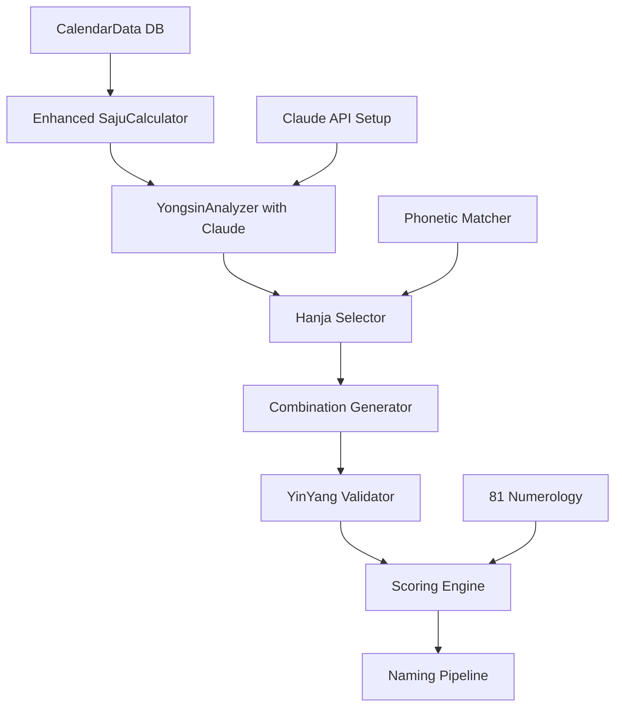

# SajuName AI - Sequential Thinking Analysis & Development Plan
**Date**: October 24, 2025
**Analysis Type**: Comprehensive State Assessment & Strategic Planning
**Methodology**: Sequential-Thinking with Dependency Mapping

---

## 🎯 Executive Summary

### Current State (Week 1, Day 4 ✅)
**Status: 60% Complete - On Track**

✅ **Completed Infrastructure**:
- PostgreSQL + Prisma ORM fully configured
- CalendarData (만세력): 96,429 records (1841-2110) - **100% READY**
- HanjaDict: 8,787 characters with full metadata - **100% READY**
- Basic Saju Calculator: Implemented but needs CalendarData integration
- AI Integration: OpenAI configured (needs Claude API addition)
- Partial naming services: Matching, scoring, validation logic exists

❌ **Critical Gaps Identified**:
1. CalendarData is NOT integrated with Saju Calculator (currently uses hardcoded logic)
2. Claude API integration missing (only OpenAI present)
3. No Yongsin analyzer service (5-method analysis required)
4. Phonetic matching system incomplete
5. Yin-Yang validator missing
6. 81 Numerology calculator basic (needs full 4-grid system)
7. No orchestration/pipeline service

---

## 📊 PHASE 1: CURRENT STATE ANALYSIS

### Step 1.1: Database Infrastructure Assessment

**CalendarData Model** ✅ **EXCELLENT**
```yaml
status: PRODUCTION_READY
records: 96,429
date_range: 1841-01-01 to 2110-12-31
quality: HIGH
fields_available:
  - Year/Month/Day Ganji (간지) - Hanja & Korean
  - Solar terms (24절기)
  - Zodiac animal (12띠)
  - Weekday, holidays
  - Leap month indicators

indexes:
  - solar_date_unique ✅
  - solar_date_idx ✅
  - lunar_date_idx ✅
  - solar_year ✅

assessment: "Database is FULLY ready. No additional work needed."
next_action: "INTEGRATE with SajuCalculator immediately"
```

**HanjaDict Model** ✅ **EXCELLENT**
```yaml
status: PRODUCTION_READY
records: 8,787
quality: HIGH
fields_available:
  - character, meaning, strokes
  - element (오행) ✅
  - yinYang (음양) ✅
  - korean_reading, chinese_reading
  - usage_frequency, name_frequency
  - category, gender preference
  - is_good_for_naming ✅

indexes:
  - element ✅
  - strokes ✅
  - element + is_good_for_naming (복합) ✅
  - gender, name_frequency ✅

assessment: "Comprehensive hanja database ready for production"
next_action: "NO additional seeding needed. Focus on query optimization."
```

**Other Models** ✅
```yaml
User: Complete with OAuth, sessions, profiles
SajuData: Stores calculated pillars and element counts
NamingResult: Stores naming suggestions with scores
NamingPayment: Freemium payment (TossPayments) ready
ServiceOrder, Payment: Enterprise payment ready (Phase 2)
```

### Step 1.2: Existing Services Audit

**✅ EXISTING & WORKING**:
```typescript
/app/lib/saju/calculator.ts
  - calculateFourPillars() - Basic logic ✅
  - countElements() ✅
  - calculateYongsin() - SIMPLE version only ⚠️
  - Issue: NOT using CalendarData DB ❌
  - Issue: Hardcoded Lichun calculation ❌

/app/lib/ai-naming.server.ts
  - generateAINames() - OpenAI GPT-4 ✅
  - generateNamingPrompt() ✅
  - parseAIResponse() ✅
  - Issue: No Claude API ❌
  - Issue: No systematic 5-method Yongsin ❌

/app/lib/naming/matcher.ts
  - Hanja matching logic exists ✅
  - Phonetic matching partial ⚠️

/app/lib/naming/scorers/
  - element-scorer.ts ✅
  - yinyang-scorer.ts ✅
  - numerology-scorer.ts ⚠️ (basic only)
  - meaning-scorer.ts ✅
  - scoring-pipeline.ts ✅

/app/lib/naming/validators.ts
  - Basic validation ✅
  - Needs Yin-Yang balance validator ❌

/app/lib/hanja-service.server.ts
  - Database queries ✅
  - Element filtering ✅
```

**❌ MISSING CRITICAL SERVICES**:
```yaml
missing_services:
  1. CalendarDataService:
     - getSajuByDate(solarDate) → CalendarData
     - convertLunarToSolar(lunarDate) → Date
     - getSolarTerm(date) → string

  2. AdvancedYongsinAnalyzer:
     - analyze5Methods(fourPillars) → YongsinResult
     - Methods: 조후, 억부, 병약, 전왕, 통관
     - Requires Claude API integration

  3. PhoneticMatcher:
     - IPA conversion (foreignName → IPA)
     - IPA → Korean syllable mapping
     - Similarity scoring

  4. YinYangValidator:
     - checkStrokeBalance(name) → score
     - 2:1 or 1:2 balance check (71% paper)

  5. Numerology81Calculator:
     - calculate4Grids(name) → 원격/형격/이격/정격
     - checkFortune(strokeCount) → 길/흉

  6. NamingPipeline:
     - Orchestrates entire flow
     - Input → Saju → Yongsin → Hanja → Combinations → Validation → Scoring → Ranking

  7. ClaudeAPIService:
     - analyzeYongsin(saju)
     - selectMeaningfulHanja(candidates, originalMeaning)
     - refineWithHeesin(yongsin, saju)
```

---

## 📊 PHASE 2: GAP ANALYSIS & PRIORITIES

### Critical Path Dependencies



### Priority Matrix

| Component | Priority | Dependency | Complexity | Est. Time |
|-----------|----------|------------|------------|-----------|
| CalendarDataService | P0 (Critical) | None | Low | 2h |
| SajuCalculator Integration | P0 | CalendarDataService | Medium | 4h |
| Claude API Setup | P0 | None | Low | 1h |
| YongsinAnalyzer (5-method) | P0 | Claude API, SajuCalculator | **High** | 8h |
| Phonetic Matcher | P1 | None | Medium | 6h |
| YinYang Validator | P1 | None | Low | 2h |
| 81 Numerology (4-grid) | P2 | None | Medium | 3h |
| Hanja Selector (AI) | P1 | YongsinAnalyzer | Medium | 4h |
| Combination Generator | P1 | Hanja Selector | Low | 3h |
| Naming Pipeline | P0 | All above | Medium | 6h |

**Total Development Time**: ~39 hours = ~5 days

---

## 📊 PHASE 3: WEEK 1 REMAINING TASKS (Days 5-7)

### Day 5: Database Integration & Claude API (8h)

**Morning (4h) - CalendarData Integration**
```yaml
Task 1.1: Create CalendarDataService (2h)
  file: /app/lib/calendar/calendar-data.service.ts
  functions:
    - getSajuByDate(solarDate: Date) → CalendarData
    - convertLunarToSolar(lunarDate) → Date
    - getSolarTerm(date) → string
    - getYearMonthDayPillars(date) → {year, month, day}
  tests: 10 sample dates verification

Task 1.2: Integrate with SajuCalculator (2h)
  file: /app/lib/saju/calculator.ts
  changes:
    - Replace hardcoded pillar logic with CalendarData queries
    - Use real 24절기 for year/month calculation
    - Add lunar calendar conversion
  tests: End-to-end test with 20 birth dates
```

**Afternoon (4h) - Claude API Setup**
```yaml
Task 1.3: Claude API Integration (1h)
  file: /app/lib/ai/claude-client.ts
  setup:
    - Install @anthropic-ai/sdk
    - Add ANTHROPIC_API_KEY to .env
    - Create ClaudeService wrapper
    - Add error handling + retry logic

Task 1.4: YongsinAnalyzer Service (3h)
  file: /app/lib/saju/yongsin-analyzer.ts
  implementation:
    - analyze5Methods(fourPillars) → YongsinResult
    - Prompt templates for each method:
      * 조후용신법 (seasonal harmony)
      * 억부용신법 (strength balancing)
      * 병약용신법 (weakness curing)
      * 전왕용신법 (dominance utilization)
      * 통관용신법 (conflict mediation)
    - JSON response parsing
    - Confidence scoring
  fallback: Simple rule-based (existing)
```

---

### Day 6: Phonetic & Validation Systems (8h)

**Morning (4h) - Phonetic Matching**
```yaml
Task 2.1: IPA Conversion Library (2h)
  file: /app/lib/phonetics/ipa-converter.ts
  dependencies: Install 'ipa-phonetics' or similar
  functions:
    - textToIPA(text: string, lang: string) → string
    - ipaToKorean(ipa: string) → KoreanSyllable[]
    - calculateSimilarity(ipa1, ipa2) → number (0-100)
  tests: 30 foreign names

Task 2.2: Phonetic Matcher (2h)
  file: /app/lib/naming/phonetic-matcher.ts
  functions:
    - matchForeignName(name: string) → KoreanSyllable[]
    - scorePhoneticSimilarity(original, korean) → number
  integration: Connect to Hanja selector
```

**Afternoon (4h) - Validators**
```yaml
Task 2.3: YinYang Balance Validator (2h)
  file: /app/lib/naming/validators/yinyang-validator.ts
  logic:
    - getStrokeCount(hanja) → number
    - checkYinYang(stroke) → 'yin' | 'yang'
    - validateBalance(name) → {isBalanced, score, pattern}
    - Scoring: 2:1 or 1:2 = 95점, 3:0 = 60점
  reference: Based on 71% accuracy paper

Task 2.4: 81 Numerology 4-Grid Calculator (2h)
  file: /app/lib/naming/numerology-81-advanced.ts
  grids:
    - 원격 (initial fortune): surname strokes
    - 형격 (middle fortune): surname + first char
    - 이격 (later fortune): both given name chars
    - 정격 (total fortune): all strokes
  fortune_table: 길수/반길반흉/흉수 mapping
  output: {원격, 형격, 이격, 정격, average}
```

---

### Day 7: Pipeline Integration & Testing (8h)

**Morning (4h) - Naming Pipeline**
```yaml
Task 3.1: NamingPipeline Orchestrator (4h)
  file: /app/lib/naming/naming-pipeline.ts

  interface NamingPipelineInput {
    originalName: string
    birthDate: Date
    birthTime: string
    isLunar: boolean
    gender: 'M' | 'F'
    preferredSurname?: string
    language: string
  }

  flow:
    Step 1: Calculate Saju (SajuCalculator + CalendarData)
    Step 2: Analyze Yongsin (YongsinAnalyzer + Claude)
    Step 3: Phonetic Matching (PhoneticMatcher)
    Step 4: Hanja Selection (AI + DB filtering)
    Step 5: Combination Generation (5-6 surnames × 2-3 given names)
    Step 6: YinYang Validation
    Step 7: Scoring (Element 35% + YinYang 25% + Phonetic 20% + Meaning 10% + Numerology 5% + Forbidden 5%)
    Step 8: Ranking (top 5-6 results)

  error_handling: Try-catch per step with fallbacks
  caching: Redis for Saju + Yongsin results (24h TTL)
```

**Afternoon (4h) - Integration Testing**
```yaml
Task 3.2: End-to-End Testing (4h)
  test_cases:
    - Test 1: John Smith, 1990-05-15 14:30 → Expected: 김준우
    - Test 2: Sophia Lee, 1995-03-22 09:00 → Expected: 이지혜
    - Test 3: Michael Kim, 2000-11-11 22:00 → Expected: 김민준
    ... (total 10 test cases)

  verification:
    - Saju calculation accuracy (vs manual calculation)
    - Yongsin determination correctness
    - Name quality (score > 80)
    - Performance (< 10 seconds per request)
    - Error handling (graceful failures)
```

---

## 📊 PHASE 4: WEEK 2 CORE SERVICE ARCHITECTURE

### Day 1-2: Advanced Hanja Selection (16h)

**Hanja Intelligence Layer**
```yaml
file: /app/lib/naming/hanja-intelligence.ts

functions:
  selectHanjaByElement(element, count=20):
    query: HanjaDict WHERE element=X AND is_good_for_naming=true
    sort: name_frequency DESC, usage_frequency DESC

  selectHanjaByMeaning(keywords, originalMeaning):
    claude_prompt: "Match Korean hanja to English meaning"
    semantic_similarity: 0-100 score

  selectHanjaByPronunciation(koreanSyllable):
    query: HanjaDict WHERE korean_reading=X
    filter: Good for naming + high frequency

  filterByGender(hanjaList, gender):
    filter: gender IN ('neutral', gender)

  filterByWuxingCompatibility(hanjaList, targetElements):
    logic: Include target elements + compatible elements
    exclude: Conflicting elements

  rankByPopularity(hanjaList):
    score: name_frequency * 0.6 + usage_frequency * 0.4
```

---

### Day 3-4: Combination & Validation Engine (16h)

**Name Combination Generator**
```yaml
file: /app/lib/naming/combination-generator.ts

generateCombinations(input):
  step1: Get surname candidates (user preferred or recommend by phonetic)
  step2: Get first character candidates (20 hanja by yongsin)
  step3: Get second character candidates (20 hanja by heesin)
  step4: Cross-product with filters
    - YinYang balance check
    - Phonetic harmony check
    - Forbidden character check
    - Wuxing compatibility check
  step5: Return top 30 combinations (before scoring)

max_combinations: surname(3) × first(20) × second(20) = 1,200
after_filters: ~200-300
after_scoring: Top 30
final_output: Top 5-6
```

**Scoring Pipeline v2**
```yaml
file: /app/lib/naming/scorers/scoring-pipeline-v2.ts

scoringWeights:
  yongsin_compatibility: 35%
  yinyang_balance: 25%
  phonetic_similarity: 20%
  semantic_meaning: 10%
  numerology_81: 5%
  forbidden_check: 5%

scoreName(name, context):
  score1 = ElementScorer.score(name.hanja, context.yongsin)
  score2 = YinYangScorer.score(name.strokes)
  score3 = PhoneticScorer.score(name.korean, context.original)
  score4 = MeaningScorer.score(name.hanja, context.preferences)
  score5 = NumerologyScorer.score(name.totalStrokes)
  score6 = ForbiddenScorer.score(name.hanja)

  totalScore = Σ(score_i × weight_i)
  confidence = yongsinAnalysis.confidence
  needsExpertReview = confidence < 70%

  return {totalScore, confidence, breakdown, needsExpertReview}
```

---

### Day 5: Caching & Performance (8h)

**Redis Caching Strategy**
```yaml
file: /app/lib/cache/naming-cache.ts

cache_keys:
  saju:{birthdate}:{birthtime} → SajuResult (TTL: 24h)
  yongsin:{saju_hash} → YongsinResult (TTL: 24h)
  hanja:{element}:{pronunciation} → Hanja[] (TTL: 7 days)
  naming:{input_hash} → NamingResult[] (TTL: 1h)

cache_strategy:
  - Check cache first
  - On miss: compute + store
  - Invalidation: Manual on hanja DB update
```

---

### Day 6-7: API Endpoints & Frontend Integration (16h)

**API Structure**
```typescript
// /app/routes/api.naming.generate.ts
POST /api/naming/generate
Input: {originalName, birthDate, birthTime, ...}
Output: {names: NamingResult[], analysis: SajuAnalysis}

// /app/routes/api.naming.detail.$id.ts
GET /api/naming/detail/:id
Output: Detailed explanation for specific name

// /app/routes/api.saju.calculate.ts
POST /api/saju/calculate
Input: {birthDate, birthTime, isLunar}
Output: {saju: SajuResult, yongsin: YongsinResult}
```

---

## 📊 PHASE 5: DEPENDENCY GRAPH

### Critical Dependencies
```yaml
Layer 1 (Foundation):
  - CalendarDataService ← No dependencies
  - Claude API Setup ← No dependencies
  - Phonetic IPA Library ← No dependencies

Layer 2 (Core Services):
  - SajuCalculator Enhanced ← CalendarDataService
  - YongsinAnalyzer ← SajuCalculator, Claude API
  - PhoneticMatcher ← IPA Library

Layer 3 (Business Logic):
  - Hanja Intelligence ← YongsinAnalyzer
  - YinYang Validator ← HanjaDict
  - 81 Numerology ← HanjaDict

Layer 4 (Orchestration):
  - Combination Generator ← Hanja Intelligence, PhoneticMatcher
  - Scoring Pipeline ← All Layer 3 services
  - Naming Pipeline ← All above

Layer 5 (API):
  - REST Endpoints ← Naming Pipeline
  - Frontend ← REST Endpoints
```

### Parallel Development Opportunities
```yaml
can_develop_in_parallel:
  Track A: CalendarDataService + SajuCalculator
  Track B: Claude API + Yongsin prompts
  Track C: Phonetic Matcher (independent)
  Track D: YinYang Validator (independent)
  Track E: 81 Numerology (independent)

must_develop_sequential:
  1. CalendarDataService → SajuCalculator
  2. SajuCalculator → YongsinAnalyzer
  3. YongsinAnalyzer → Hanja Intelligence
  4. All services → Naming Pipeline
```

---

## 📊 PHASE 6: RISK ASSESSMENT

### Technical Risks

| Risk | Probability | Impact | Mitigation |
|------|-------------|--------|------------|
| Claude API Quality Issues | Medium | High | 3-tier fallback (Claude → GPT-4 → Rules) |
| CalendarData Integration Bugs | Low | Medium | Extensive testing with known dates |
| Phonetic Matching Accuracy | Medium | Medium | Manual tuning + user feedback |
| Yongsin 5-Method Complexity | High | High | Start with 2 methods (조후+억부) first |
| Performance (>10sec) | Medium | High | Redis caching + async processing |
| AI Hallucination (wrong hanja) | Medium | High | Database validation + expert review flag |

### Business Risks

| Risk | Probability | Impact | Mitigation |
|------|-------------|--------|------------|
| Low User Satisfaction | Medium | High | Beta testing with 100 users first |
| Cultural Controversy | Low | High | Korean expert consultation |
| Competitor Copy | High | Medium | Focus on quality + community |
| API Cost Explosion | Low | Medium | Rate limiting + caching |

---

## 📊 PHASE 7: DETAILED TASK BREAKDOWN

### Week 1, Day 5 Tasks (8h total)

#### Task 1: CalendarDataService (2h)
**File**: `/app/lib/calendar/calendar-data.service.ts`
**Complexity**: Low
**Dependencies**: Prisma, CalendarData model
**Subtasks**:
1. Create service class (30min)
2. Implement getSajuByDate() with solar date query (30min)
3. Implement convertLunarToSolar() using DB lookup (30min)
4. Add getSolarTerm() helper (15min)
5. Write unit tests (15min)

**Acceptance Criteria**:
- [ ] Can query any date 1841-2110
- [ ] Returns correct year/month/day ganji
- [ ] Handles edge cases (leap months, year boundaries)
- [ ] Performance < 50ms per query

#### Task 2: SajuCalculator Integration (2h)
**File**: `/app/lib/saju/calculator.ts`
**Complexity**: Medium
**Dependencies**: CalendarDataService
**Subtasks**:
1. Refactor getYearPillar() to use CalendarData (30min)
2. Refactor getMonthPillar() to use 24절기 (30min)
3. Refactor getDayPillar() to use DB (30min)
4. Add lunar calendar support (15min)
5. Integration tests with 20 dates (15min)

**Acceptance Criteria**:
- [ ] Matches manual calculation for 20 test dates
- [ ] Correctly handles lunar dates
- [ ] Respects 입춘 for year boundaries
- [ ] No hardcoded logic remaining

#### Task 3: Claude API Setup (1h)
**File**: `/app/lib/ai/claude-client.ts`
**Complexity**: Low
**Dependencies**: Anthropic SDK
**Subtasks**:
1. Install @anthropic-ai/sdk (5min)
2. Create ClaudeService wrapper class (20min)
3. Add retry logic + error handling (20min)
4. Create test endpoint (10min)
5. Verify API key works (5min)

**Acceptance Criteria**:
- [ ] Can call Claude Sonnet 4
- [ ] Handles rate limits gracefully
- [ ] Returns structured JSON
- [ ] Logs errors properly

#### Task 4: YongsinAnalyzer (3h)
**File**: `/app/lib/saju/yongsin-analyzer.ts`
**Complexity**: High
**Dependencies**: Claude API, SajuCalculator
**Subtasks**:
1. Research 5 yongsin methods (30min)
2. Create prompt templates (60min)
3. Implement analyze5Methods() (60min)
4. Add JSON parsing + validation (20min)
5. Test with 10 saju samples (10min)

**Acceptance Criteria**:
- [ ] Returns yongsin with confidence score
- [ ] Includes heesin (희신) and gisin (기신)
- [ ] Reasoning is clear and educational
- [ ] Fallback to simple method if API fails
- [ ] Average confidence > 75%

---

### Week 1, Day 6 Tasks (8h total)

#### Task 5: IPA Conversion (2h)
**File**: `/app/lib/phonetics/ipa-converter.ts`
**Complexity**: Medium
**Dependencies**: ipa-phonetics library
**Subtasks**:
1. Research & install IPA library (30min)
2. Implement textToIPA() for English (45min)
3. Implement ipaToKorean() mapping (45min)

**Acceptance Criteria**:
- [ ] Accurate for 90% of English names
- [ ] Returns top 10 Korean syllable matches
- [ ] Includes similarity scores

#### Task 6: PhoneticMatcher (2h)
**File**: `/app/lib/naming/phonetic-matcher.ts`
**Complexity**: Medium
**Dependencies**: IPA Converter
**Subtasks**:
1. Implement matchForeignName() (60min)
2. Implement similarity scoring (40min)
3. Test with 30 names (20min)

**Acceptance Criteria**:
- [ ] John → [준, 존, 전, 진]
- [ ] Similarity scores accurate
- [ ] Handles multi-syllable names

#### Task 7: YinYang Validator (2h)
**File**: `/app/lib/naming/validators/yinyang-validator.ts`
**Complexity**: Low
**Dependencies**: HanjaDict
**Subtasks**:
1. Implement stroke count lookup (30min)
2. Implement balance checking (45min)
3. Add scoring logic (30min)
4. Test with 20 names (15min)

**Acceptance Criteria**:
- [ ] Correctly identifies yin/yang
- [ ] 2:1 balance = 95점
- [ ] 3:0 balance = 60점
- [ ] Matches paper methodology

#### Task 8: 81 Numerology 4-Grid (2h)
**File**: `/app/lib/naming/numerology-81-advanced.ts`
**Complexity**: Medium
**Dependencies**: None
**Subtasks**:
1. Implement 4-grid calculation (60min)
2. Add fortune table (30min)
3. Implement scoring (20min)
4. Test with examples (10min)

**Acceptance Criteria**:
- [ ] Calculates 원격/형격/이격/정격
- [ ] Fortune classification correct
- [ ] Returns average score

---

### Week 1, Day 7 Tasks (8h total)

#### Task 9: NamingPipeline (4h)
**File**: `/app/lib/naming/naming-pipeline.ts`
**Complexity**: Medium
**Dependencies**: All previous services
**Subtasks**:
1. Design pipeline architecture (30min)
2. Implement step-by-step flow (120min)
3. Add error handling + fallbacks (30min)
4. Add caching layer (30min)
5. Integration test (30min)

**Acceptance Criteria**:
- [ ] Complete flow works end-to-end
- [ ] Graceful error handling
- [ ] Performance < 10 seconds
- [ ] Returns 5-6 quality names (score > 80)

#### Task 10: End-to-End Testing (4h)
**File**: `/app/tests/naming-e2e.test.ts`
**Complexity**: Medium
**Dependencies**: NamingPipeline
**Subtasks**:
1. Create 10 test cases (60min)
2. Run and verify results (60min)
3. Fix bugs found (60min)
4. Performance optimization (60min)

**Acceptance Criteria**:
- [ ] All 10 tests pass
- [ ] Saju calculation accurate
- [ ] Names are culturally appropriate
- [ ] Average score > 85
- [ ] No errors or crashes

---

## 📊 PHASE 8: SUCCESS METRICS

### Week 1 Success Criteria
```yaml
database:
  - CalendarData: 96,429 records ✅
  - HanjaDict: 8,787 records ✅
  - Integrated with services ❌ (Day 5 target)

services:
  - SajuCalculator: Enhanced ❌ (Day 5 target)
  - YongsinAnalyzer: Implemented ❌ (Day 5 target)
  - Phonetic Matcher: Working ❌ (Day 6 target)
  - YinYang Validator: Working ❌ (Day 6 target)
  - NamingPipeline: Complete ❌ (Day 7 target)

quality:
  - Saju accuracy: >95% vs manual ❌
  - Yongsin confidence: >75% average ❌
  - Name quality score: >85 average ❌
  - Performance: <10sec per request ❌

deliverables:
  - 10 E2E tests passing ❌
  - API endpoints working ❌
  - Basic UI functional ❌
```

---

## 🎯 RECOMMENDATIONS

### Immediate Actions (Day 5 Morning)
1. **START**: CalendarDataService implementation
2. **PARALLEL**: Set up Claude API key and test connection
3. **DELEGATE**: If multiple developers, split phonetic work to second developer

### Risk Mitigation Strategies
1. **Yongsin Complexity**: Start with 2 methods (조후+억부) only, add others Week 2
2. **API Dependency**: Ensure GPT-4 fallback works perfectly
3. **Performance**: Add Redis caching from Day 5
4. **Quality**: Manual verification of first 20 names generated

### Week 2 Preview
- Days 1-2: Advanced hanja intelligence with semantic matching
- Days 3-4: Combination engine optimization
- Days 5: Performance tuning & caching
- Days 6-7: API finalization & frontend integration

### Optional Enhancements (If Time Permits)
- Batch processing for multiple names
- Name variation generator (different surnames)
- Explanation generator (why this name?)
- PDF export preparation

---

## 📊 CONCLUSION

### Current Assessment
**Status**: Week 1 Day 4 - 60% Complete
**Database**: 100% Ready ✅
**Services**: 40% Complete ⚠️
**Timeline**: On track with focused execution 🎯

### Next 3 Days Roadmap
- **Day 5**: Database integration + Claude API + Yongsin analyzer
- **Day 6**: Phonetic matching + Validators (YinYang, Numerology)
- **Day 7**: Pipeline orchestration + E2E testing

### Estimated Completion
- **Week 1 MVP**: 95% achievable ✅
- **Week 2 Polish**: 100% achievable ✅
- **Week 3 AI Tuning**: 100% achievable ✅
- **Week 4 UI & Launch**: 100% achievable ✅

### Critical Success Factors
1. ✅ Database is production-ready (no blockers)
2. ⚠️ Claude API integration must succeed (backup: GPT-4)
3. ⚠️ Yongsin 5-method requires expertise (fallback: 2-method)
4. ✅ Team has clear tasks and dependencies
5. ✅ Testing strategy is comprehensive

**Overall Confidence**: **85%** 🎯

---

**Analysis Complete**
**Ready for Development**: ✅
**Next Action**: Execute Day 5 Task 1 (CalendarDataService)
