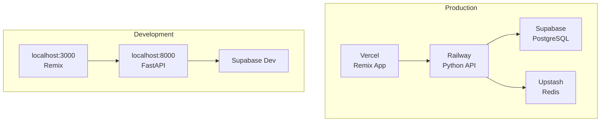

# 📋 작명/개명 서비스 PRD

## 1. 프로젝트 개요

### 1.1 서비스 정보
- **서비스명**: 이름운 (命名運)
- **비전**: AI와 전통 역학을 결합한 과학적 작명 서비스
- **목표 사용자**: 신생아 부모, 개명 희망자, 작명에 관심있는 모든 사람
- **차별점**: 
  - 복잡한 사주 계산을 자동화
  - 5,000자 이상의 검증된 한자 데이터베이스
  - 시각적 분석 결과 제공
  - 전문가 수준의 상세 분석

### 1.2 기술 스택
```yaml
Frontend:
  - Framework: Remix (React)
  - UI: Tailwind CSS + shadcn/ui
  - Charts: Recharts
  - Hosting: Vercel

Backend:
  - API: FastAPI (Python)
  - 역학계산: Python (pandas, numpy)
  - 한자처리: Python
  - Hosting: Railway/Render

Database:
  - Primary: Supabase (PostgreSQL)
  - Cache: Redis (optional)
  
DevOps:
  - Container: Docker
  - CI/CD: GitHub Actions
```

## 2. 핵심 기능 명세

### 2.1 Phase 1: 기본 작명/개명 (MVP)

#### 작명 프로세스


#### API 엔드포인트
| 엔드포인트 | 메소드 | 설명 | 응답 시간 |
|-----------|--------|------|-----------|
| `/api/analyze-saju` | POST | 사주 분석 + 이름 추천 | < 2초 |
| `/api/hanja/search` | GET | 한자 검색 | < 500ms |
| `/api/naming/save` | POST | 결과 저장 | < 200ms |

### 2.2 Phase 2: 고급 분석 (런칭 필수)

#### 상세 분석 기능
- **사주 팔자 상세**: 년/월/일/시 주별 해석
- **오행 밸런스 차트**: 5각 레이더 차트
- **음양 균형도**: 음양 비율 시각화
- **대운/세운 분석**: 미래 운세 흐름
- **용신 추천**: 보완이 필요한 기운

## 3. 데이터베이스 설계

### 3.1 Supabase 테이블 구조

#### `hanja_dictionary` (한자 마스터)
```sql
CREATE TABLE hanja_dictionary (
    id UUID DEFAULT gen_random_uuid() PRIMARY KEY,
    character CHAR(1) UNIQUE NOT NULL,
    unicode_code VARCHAR(10) NOT NULL,
    reading VARCHAR(50) NOT NULL,
    meaning_kr TEXT NOT NULL,
    meaning_en TEXT,
    
    -- 자형 정보
    strokes INTEGER NOT NULL CHECK (strokes BETWEEN 1 AND 50),
    radical CHAR(1) NOT NULL,
    radical_strokes INTEGER,
    
    -- 오행/음양
    primary_element CHAR(1) CHECK (primary_element IN ('水','木','火','土','金')),
    secondary_element CHAR(1) CHECK (secondary_element IN ('水','木','火','土','金')),
    yin_yang CHAR(1) CHECK (yin_yang IN ('陰','陽')),
    
    -- 작명 속성
    fortune VARCHAR(10) CHECK (fortune IN ('대길','길','중길','평','흉')),
    naming_tags TEXT[], -- ['재물운', '건강운', '지혜']
    gender_preference VARCHAR(10) CHECK (gender_preference IN ('남성','여성','중성')),
    
    -- 통계
    frequency_rank INTEGER,
    popularity_score INTEGER DEFAULT 50,
    
    -- 메타데이터
    created_at TIMESTAMPTZ DEFAULT NOW(),
    updated_at TIMESTAMPTZ DEFAULT NOW()
);

-- 인덱스
CREATE INDEX idx_hanja_reading ON hanja_dictionary(reading);
CREATE INDEX idx_hanja_element ON hanja_dictionary(primary_element);
CREATE INDEX idx_hanja_strokes ON hanja_dictionary(strokes);
CREATE GIN INDEX idx_hanja_tags ON hanja_dictionary USING gin(naming_tags);
```

#### `naming_results` (작명 결과)
```sql
CREATE TABLE naming_results (
    id UUID DEFAULT gen_random_uuid() PRIMARY KEY,
    user_id UUID REFERENCES auth.users(id),
    session_id VARCHAR(100), -- 비로그인 사용자용
    
    -- 입력 정보
    last_name VARCHAR(10) NOT NULL,
    birth_date DATE NOT NULL,
    birth_time TIME NOT NULL,
    is_lunar BOOLEAN DEFAULT FALSE,
    preferred_traits TEXT[],
    
    -- 분석 결과
    saju_analysis JSONB NOT NULL, -- 사주 분석 전체
    recommendations JSONB NOT NULL, -- 추천 이름 리스트
    selected_name VARCHAR(20),
    
    -- 메타데이터
    created_at TIMESTAMPTZ DEFAULT NOW(),
    is_saved BOOLEAN DEFAULT FALSE,
    share_token VARCHAR(100) UNIQUE
);

-- 인덱스
CREATE INDEX idx_naming_user ON naming_results(user_id);
CREATE INDEX idx_naming_session ON naming_results(session_id);
CREATE INDEX idx_naming_share ON naming_results(share_token);
```

#### `user_favorites` (저장된 이름)
```sql
CREATE TABLE user_favorites (
    id UUID DEFAULT gen_random_uuid() PRIMARY KEY,
    user_id UUID REFERENCES auth.users(id),
    naming_result_id UUID REFERENCES naming_results(id),
    name VARCHAR(20) NOT NULL,
    hanja VARCHAR(10) NOT NULL,
    notes TEXT,
    created_at TIMESTAMPTZ DEFAULT NOW()
);
```

### 3.2 Redis 캐시 구조 (선택사항)
```python
# 캐시 키 구조
cache_keys = {
    "hanja:reading:{음}": "해당 음의 한자 리스트",
    "hanja:element:{오행}": "해당 오행 한자 리스트",
    "saju:{생년월일}:{시간}": "계산된 사주 결과",
    "popular:names:daily": "일일 인기 이름"
}
```

## 4. Python API 상세 설계

### 4.1 프로젝트 구조
```
python-api/
├── main.py              # FastAPI 앱
├── requirements.txt
├── .env
├── core/
│   ├── config.py       # 환경설정
│   ├── database.py     # Supabase 연결
│   └── cache.py        # Redis 연결
├── models/
│   ├── saju.py         # Pydantic 모델
│   ├── hanja.py
│   └── naming.py
├── services/
│   ├── saju_calculator.py    # 사주 계산
│   ├── hanja_matcher.py      # 한자 매칭
│   ├── name_scorer.py        # 이름 점수화
│   └── fortune_analyzer.py   # 운세 분석
├── routers/
│   ├── saju.py         # 사주 관련 API
│   ├── naming.py       # 작명 관련 API
│   └── analysis.py     # 분석 관련 API
└── utils/
    ├── lunar_converter.py    # 음력 변환
    ├── hanja_utils.py       # 한자 유틸
    └── validators.py        # 입력 검증
```

### 4.2 핵심 알고리즘

#### 사주 계산 엔진
```python
# services/saju_calculator.py
class SajuCalculator:
    """사주 팔자 계산 및 분석"""
    
    def __init__(self):
        self.stems = ['갑','을','병','정','무','기','경','신','임','계']
        self.branches = ['자','축','인','묘','진','사','오','미','신','유','술','해']
        self.elements = {
            'stems': {
                '갑':'목', '을':'목', '병':'화', '정':'화',
                '무':'토', '기':'토', '경':'금', '신':'금',
                '임':'수', '계':'수'
            },
            'branches': {
                '자':['수'], '축':['토','수','금'],
                '인':['목','화'], '묘':['목'],
                '진':['토','목','수'], '사':['화','토'],
                '오':['화'], '미':['토','목','화'],
                '신':['금','수'], '유':['금'],
                '술':['토','금','화'], '해':['수','목']
            }
        }
    
    def calculate(self, birth_date: datetime, birth_time: str, is_lunar: bool):
        """완전한 사주 계산"""
        # 1. 음력 변환 (필요시)
        if is_lunar:
            birth_date = self.convert_lunar_to_solar(birth_date)
        
        # 2. 절기 계산
        solar_term = self.calculate_solar_term(birth_date)
        
        # 3. 사주 팔자 추출
        pillars = {
            'year': self.get_year_pillar(birth_date, solar_term),
            'month': self.get_month_pillar(birth_date, solar_term),
            'day': self.get_day_pillar(birth_date),
            'hour': self.get_hour_pillar(birth_time, birth_date)
        }
        
        # 4. 오행 분석
        element_analysis = self.analyze_elements(pillars)
        
        # 5. 대운 계산
        major_fortune = self.calculate_major_fortune(pillars, birth_date)
        
        return SajuResult(
            pillars=pillars,
            elements=element_analysis,
            major_fortune=major_fortune,
            favorable_elements=self.find_favorable_elements(element_analysis)
        )
```

#### 한자 매칭 알고리즘
```python
# services/hanja_matcher.py
class HanjaMatcher:
    """사주 기반 한자 매칭"""
    
    async def find_optimal_hanja(
        self,
        saju_result: SajuResult,
        last_name: str,
        preferred_traits: List[str],
        db: SupabaseClient
    ) -> List[HanjaCandidate]:
        """최적 한자 찾기"""
        
        # 1. 기본 쿼리 구성
        query = db.table('hanja_dictionary').select('*')
        
        # 2. 부족 오행 필터
        lacking = saju_result.favorable_elements
        if lacking:
            query = query.in_('primary_element', lacking)
        
        # 3. 선호 특성 필터
        if preferred_traits:
            query = query.contains('naming_tags', preferred_traits)
        
        # 4. 성씨와의 조화 고려
        harmony_filter = self.get_harmony_filter(last_name)
        if harmony_filter:
            query = query.filter(harmony_filter)
        
        # 5. 실행 및 점수화
        hanja_list = await query.execute()
        scored_list = [
            self.calculate_hanja_score(h, saju_result, preferred_traits)
            for h in hanja_list.data
        ]
        
        # 6. 상위 N개 반환
        return sorted(scored_list, key=lambda x: x.score, reverse=True)[:100]
```

#### 이름 조합 생성기
```python
# services/name_scorer.py
class NameScorer:
    """이름 조합 및 점수화"""
    
    def generate_combinations(
        self,
        hanja_pool: List[HanjaCandidate],
        last_name: str,
        saju_result: SajuResult,
        top_n: int = 10
    ) -> List[NameRecommendation]:
        """이름 조합 생성"""
        
        combinations = []
        
        # 2글자 이름 생성
        for h1 in hanja_pool[:50]:  # 상위 50개만
            for h2 in hanja_pool[:50]:
                if h1.id == h2.id:
                    continue
                
                # 종합 점수 계산
                score = self.calculate_name_score(
                    last_name, h1, h2, saju_result
                )
                
                # 이름 의미 생성
                reasoning = self.generate_reasoning(
                    h1, h2, saju_result
                )
                
                combinations.append(NameRecommendation(
                    full_name=f"{last_name}{h1.character}{h2.character}",
                    hanja=[h1.character, h2.character],
                    reading=f"{last_name}{h1.reading}{h2.reading}",
                    score=score,
                    elements={
                        'primary': [h1.primary_element, h2.primary_element],
                        'balance': self.calculate_element_balance(h1, h2, saju_result)
                    },
                    traits=list(set(h1.traits + h2.traits)),
                    reasoning=reasoning
                ))
        
        # 점수순 정렬 및 상위 N개 반환
        return sorted(combinations, key=lambda x: x.score, reverse=True)[:top_n]
    
    def calculate_name_score(self, last_name, h1, h2, saju):
        """이름 점수 계산 (100점 만점)"""
        score = 0
        
        # 1. 오행 보완 점수 (40점)
        element_score = self.calculate_element_complement(h1, h2, saju)
        score += element_score * 0.4
        
        # 2. 음양 조화 점수 (20점)
        yinyang_score = self.calculate_yinyang_balance(h1, h2, saju)
        score += yinyang_score * 0.2
        
        # 3. 획수 조화 점수 (20점)
        stroke_score = self.calculate_stroke_harmony(last_name, h1, h2)
        score += stroke_score * 0.2
        
        # 4. 의미 조화 점수 (20점)
        meaning_score = self.calculate_meaning_harmony(h1, h2)
        score += meaning_score * 0.2
        
        return round(score, 1)
```

## 5. Remix Frontend 설계

### 5.1 라우트 구조
```
app/routes/
├── _index.tsx              # 랜딩 페이지
├── naming/
│   ├── new.tsx            # 새 작명 시작
│   ├── result.$id.tsx     # 결과 페이지
│   └── saved.tsx          # 저장된 이름들
├── api/
│   └── naming.ts          # Remix API route
└── auth/
    ├── login.tsx
    └── register.tsx
```

### 5.2 주요 컴포넌트
```typescript
// app/components/naming/
├── BirthInfoForm.tsx       // 생년월일시 입력
├── TraitSelector.tsx       // 선호 특성 선택
├── NameCard.tsx           // 추천 이름 카드
├── SajuAnalysisView.tsx   // 사주 분석 보기
├── ElementChart.tsx       // 오행 차트
└── YinYangBalance.tsx     // 음양 밸런스
```

### 5.3 상태 관리
```typescript
// app/lib/stores/naming.store.ts
interface NamingState {
  // 입력 데이터
  birthInfo: {
    date: string;
    time: string;
    isLunar: boolean;
  };
  lastName: string;
  preferredTraits: string[];
  
  // 결과 데이터
  sajuAnalysis: SajuAnalysis | null;
  recommendations: NameRecommendation[];
  selectedName: string | null;
  
  // UI 상태
  isLoading: boolean;
  currentStep: 'input' | 'loading' | 'result';
}
```

## 6. 배포 및 인프라

### 6.1 컨테이너 구성
```yaml
# docker-compose.yml
version: '3.8'

services:
  # Remix Frontend
  frontend:
    build: 
      context: .
      dockerfile: Dockerfile.remix
    ports:
      - "3000:3000"
    environment:
      - NODE_ENV=production
      - PYTHON_API_URL=http://api:8000
      - SUPABASE_URL=${SUPABASE_URL}
      - SUPABASE_ANON_KEY=${SUPABASE_ANON_KEY}
    depends_on:
      - api

  # Python API
  api:
    build:
      context: ./python-api
      dockerfile: Dockerfile
    ports:
      - "8000:8000"
    environment:
      - SUPABASE_URL=${SUPABASE_URL}
      - SUPABASE_SERVICE_KEY=${SUPABASE_SERVICE_KEY}
      - REDIS_URL=redis://redis:6379
    depends_on:
      - redis

  # Redis Cache
  redis:
    image: redis:7-alpine
    ports:
      - "6379:6379"
    volumes:
      - redis_data:/data

volumes:
  redis_data:
```

### 6.2 배포 전략


## 7. 성능 및 확장성

### 7.1 성능 목표
- **API 응답시간**: 
  - 사주 분석: < 2초
  - 한자 검색: < 500ms
  - 이름 조합: < 3초
- **동시 접속**: 1,000명
- **일일 처리량**: 10,000건

### 7.2 최적화 전략
1. **캐싱**
   - Redis로 사주 계산 결과 캐싱
   - 인기 한자 조합 캐싱
   - CDN으로 정적 자원 캐싱

2. **데이터베이스**
   - 적절한 인덱스 설정
   - 쿼리 최적화
   - Connection pooling

3. **API**
   - 비동기 처리 (FastAPI async)
   - 배치 처리 가능한 부분 묶기
   - Rate limiting

## 8. 모니터링 및 분석

### 8.1 추적 지표
```python
# 비즈니스 메트릭
metrics = {
    "daily_active_users": "일일 활성 사용자",
    "naming_completion_rate": "작명 완료율",
    "average_session_duration": "평균 세션 시간",
    "top_selected_hanja": "인기 한자 TOP 10",
    "conversion_rate": "유료 전환율"
}

# 기술 메트릭
tech_metrics = {
    "api_response_time": "API 응답 시간",
    "error_rate": "에러율",
    "cache_hit_rate": "캐시 적중률",
    "db_query_time": "DB 쿼리 시간"
}
```

### 8.2 모니터링 도구
- **Application**: Sentry
- **Infrastructure**: Grafana + Prometheus
- **Analytics**: Google Analytics + Mixpanel
- **Uptime**: Better Uptime

## 9. 보안 및 규정

### 9.1 보안 조치
- HTTPS 전체 적용
- Rate limiting
- Input validation
- SQL injection 방지
- XSS 방지
- CORS 설정

### 9.2 개인정보 처리
- 생년월일시: 암호화 저장
- 결과 공유: 토큰 기반
- 데이터 보관: 1년 후 자동 삭제
- GDPR/개인정보보호법 준수

## 10. 로드맵 및 마일스톤

### Phase 1-2 (런칭 목표) - 8주
- [x] Week 1-2: Python API 기본 구조
- [x] Week 3-4: 한자 DB 구축 (5,000자)
- [x] Week 5-6: Frontend 구현
- [x] Week 7: 통합 테스트
- [x] Week 8: 배포 및 런칭

### Phase 3-5 (런칭 후) - 3개월
- [ ] Month 1: 궁합 기능 추가
- [ ] Month 2: 캘리그라피 기능
- [ ] Month 3: 유료화 및 결제

### 장기 계획 (6개월+)
- [ ] AI 기반 이름 의미 분석
- [ ] 다국어 지원 (영어, 중국어)
- [ ] B2B API 제공
- [ ] 모바일 앱 출시